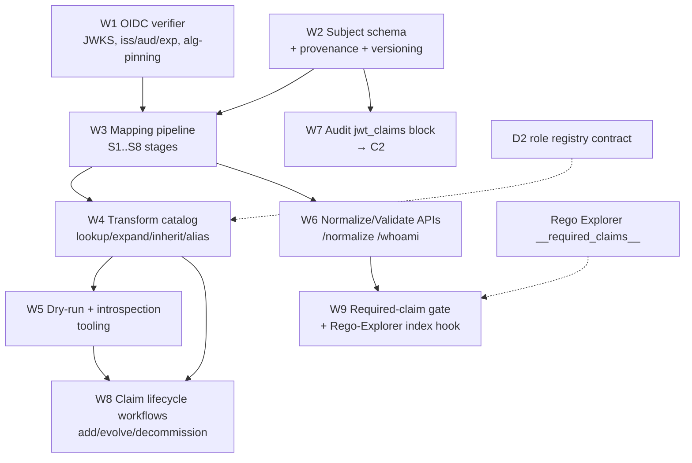

# D1 — Keycloak / JWT Integration & Mapping Layer — PLAN

**Component:** D1 · **Spec:** see `SPEC.md` · **Domain:** D · Identity, Authz & Security

---

## 1. Dependency DAG

**Critical path:** W1 → W3 → W4 → W8 (verification → pipeline → transforms → lifecycle).
W2 (schema) is a near-zero-cost prerequisite that unblocks W3 and W7 in parallel.

## 2. Parallelizable workstreams
| WS | Can start | Blocks | Parallel with |
|---|---|---|---|
| W1 OIDC verifier | immediately | W3, W6 | W2 |
| W2 Subject schema + provenance | immediately | W3, W7 | W1 |
| W3 Mapping pipeline (S1–S8) | after W1, W2 | W4, W6 | — |
| W4 Transform catalog | after W3 | W5, W8 | W6 |
| W5 Dry-run/introspection tooling | after W4 | W8 | W6 |
| W6 Normalize/Validate/whoami APIs | after W3 | W9 | W4, W5 |
| W7 Audit `jwt_claims` block | after W2 | (C2 integration) | W3, W4 |
| W8 Claim lifecycle workflows | after W4, W5 | — | W9 |
| W9 Required-claim gate + Rego-Explorer hook | after W6 | — | W8 |

**Three independent fronts after W1+W2:** (a) pipeline+transforms (W3→W4→W5→W8),
(b) API surface (W6→W9), (c) audit contribution (W7). They reconverge at integration.

## 3. Milestones
- **M1 — Verify & normalize MVP:** W1+W2+W3 minimal (lowercase, source-select) →
  `/normalize` returns a canonical subject for a single IdP. Unblocks D2 integration.
- **M2 — Multi-IdP + expansion:** W4 transforms (`expand_group_hierarchy`,
  `prefer_first_non_empty`, `tenant_inherit`, `alias`) → DT-36/DT-38/HL-16 pass.
- **M3 — Tooling & lifecycle:** W5 dry-run + W8 add/evolve/decommission → DT-35/DT-37 pass.
- **M4 — Hardening & integration:** W7 audit block wired to C2; W9 required-claim gate wired
  to Rego Explorer; security hardening (alg-pinning, RS/HS guard, fail-closed JWKS).

## 4. Test strategy
### 4.1 Unit / pipeline
- Each transform: pure-function table tests incl. `onMissing`/`onUnrecognized`/conflict.
- Determinism: same token+mapping ⇒ byte-identical subject (D1-R6) — golden fixtures.
- Schema-version round-trip: additive vs breaking change detection.

### 4.2 Security negative tests (must-have)
- `alg:none` rejected; RS/HS confusion rejected; wrong `aud` rejected; expired/`nbf`-future
  rejected; untrusted `iss` rejected; tampered signature rejected.
- **JWKS-expiry fail-closed test:** expired cache + unreachable JWKS ⇒ reject (not skip).
- No raw token in any log line (log-scrub assertion).

### 4.3 Scenario acceptance (gold)
| Scenario | Assertion |
|---|---|
| DT-35 | `risk_level` mapping added; dry-run distribution incl. `unknown`; subject exposes canonical `risk_level`; **no Keycloak realm change**. |
| DT-36 | Both IdPs → `tenants:["payments"]`; **no Rego/Gatekeeper/Conftest file modified**. |
| DT-37 | Zero references proven; replay `complete` preserved; token size drops; rollback artifact retained. |
| DT-38 | Expanded `roles[]` contains leaf + every ancestor; each role registered in D2 registry. |
| HL-16 | New federated IdP onboarded via mapping-only change; drift flag clears. |
| HL-13 | `tenant`+`namespaces` normalized; cross-tenant subject cannot be normalized into tenant-a scope. |

### 4.4 Required-claim coverage test
Deploy a policy declaring `__required_claims__: [risk_level]`; present a token lacking it ⇒
`normalization_status=incomplete`, `missing_required:["risk_level"]`, PDP fails closed.

## 5. Concurrency summary
- **Buildable concurrently:** W1, W2, W7 from day 0; W6 API surface vs W4/W5 pipeline tooling.
- **Hard blockers:** W3 needs W1+W2; W8 lifecycle needs W4 transforms + W5 dry-run.
- **External contract dependency:** W4 `expand_group_hierarchy` output must match D2's role
  registry naming (`role:<group>`); agree the contract before W4 lands (joint D1/D2 task).
- **Feeds:** W7 must be ready before C2 can finalize the `jwt_claims` column family.
