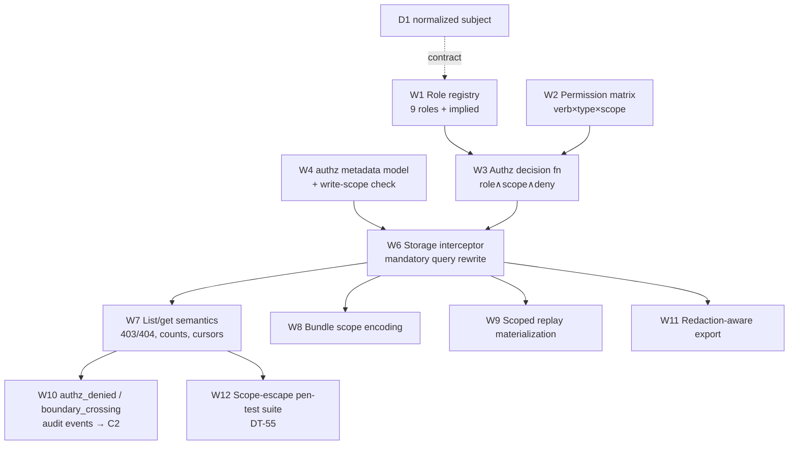

# D2 — Scoped Roles, Permissions & Storage Authorization — PLAN

**Component:** D2 · **Spec:** `SPEC.md` · **Alt:** `ALT-opa-rls-spicedb.md` · **Domain:** D

---

## 1. Dependency DAG

**Critical path:** W4 → W6 → W7 → W12 (metadata → interceptor → list/get semantics →
prove no escape). W6 (the interceptor) is the keystone — everything funnels through it.

## 2. Parallelizable workstreams
| WS | Starts after | Parallel with |
|---|---|---|
| W1 Role registry | D1 role contract agreed | W2, W4 |
| W2 Permission matrix (§4) | — | W1, W4 |
| W3 Decision function | W1, W2 | W4 |
| W4 Authz metadata + write-scope | — | W1, W2, W3 |
| W6 Storage interceptor | W3, W4 | — (keystone) |
| W7 List/get semantics (403/404/counts) | W6 | W8, W9, W11 |
| W8 Bundle scope encoding | W6 | W7, W9 |
| W9 Scoped replay materialization | W6 | W7, W8 |
| W10 Audit events | W7 | W11 |
| W11 Redaction export | W6 | W10 |
| W12 Pen-test suite | W7 | (continuous) |

**Front A** (role/permission logic: W1+W2+W3) and **Front B** (storage metadata: W4) build in
parallel and converge at W6. After W6, W7–W11 fan out.

## 3. Milestones
- **M1 — Decision core:** W1+W2+W3 → `authorize(subject,verb,object)` unit-correct vs the §4
  matrix for all 9 roles. (Pure, no storage.)
- **M2 — Storage choke point:** W4+W6 → every read rewritten; direct-storage-access lint fails
  the build. One endpoint (`/violations`) end-to-end scoped.
- **M3 — No-escape semantics:** W7+W8+W9 → 404-by-ID, filtered counts/cursors, bundle
  exclusion, materialized replay. DT-55 + HL-13 pass.
- **M4 — Audit + export + hardening:** W10 boundary-crossing (DT-54), W11 redaction (DT-57),
  W12 pen-test suite green and wired into CI release gate.

## 4. Test strategy (authz-heavy — negative tests are first-class)

### 4.1 Matrix-coverage tests (positive + negative)
For **each of the 9 roles × each of the 18 permission rows** in §4: assert grant/deny exactly
as tabled, at the *role layer*; then the same with in-scope vs out-of-scope objects at the
*scope layer*. This is the authoritative regression for the matrix (~9×18×2 cases).

### 4.2 Scope-escape / GUI-bypass suite (DT-55 — the crown jewel)
- Direct `curl` with NS-author token, explicit `?namespace=billing` → **403, no rows**.
- Unfiltered list `?cluster=cluster-a` → only `payments-*` rows; **count/cursor over filtered
  set** (assert total ≠ true total).
- Probe `/policies /simulations /audit-fixtures /policy-bundles` → out-of-scope excluded.
- `GET /objects/{out-of-scope-id}` → **404** (not 403) — enumeration defeated.
- Same query via Console, curl, CI job, MCP client → **identical denial** (caller-independent).
- Every denial → `authz_denied` event with subject + requested scope + correlation_id.
- **Run on every storage release; regression = P0.**

### 4.3 Separation-of-duties tests
- NS-Author cannot `policy:promote-enforce` (only NS-Approver can).
- Author of a policy cannot approve their own exception/approval (SoD; ties to D3).
- Workflow Integrator has **no** `policy:view`/`report:view` (narrowness assertion).
- Auditor write-attempts (edit/approve/simulate-write) all denied; replay read-only OK.

### 4.4 Cross-tenant admin audit (DT-54)
Global Plat-Admin queries 2 tenants → access allowed **and** `boundary_crossing` event emitted
with literal query, accessed tenants/namespaces, result count, correlation_id. Audit-sink-down
→ cross-tenant read **blocked** (audit precondition).

### 4.5 Materialization & export
- HL-18: Auditor replay runs over a *materialized scoped dataset*, not the live store.
- DT-57: export gated by visibility, redaction applied, pre-redaction `original_hash` in
  manifest.

### 4.6 Data-defect tests
- Object missing `authz` metadata → invisible to all but Plat-Admin (audited).
- D1 subject `incomplete` → fail closed (empty filtered set + warning).

## 5. Concurrency summary
- **Day-0 parallel:** W1, W2, W4 (and ALT evaluation in parallel as a spike).
- **Keystone serialization:** W6 must land before W7–W11; design W6's predicate to be
  storage-engine-agnostic so the ALT (RLS / OPA / SpiceDB) can swap in without touching W7+.
- **Cross-component:** W1 needs D1's `role:<x>` naming; W10 needs C2's audit-event shape; the
  SoD tests (§4.3) co-design with D3's approval gate.
- **CI gate:** the §4.2 scope-escape suite is a **mandatory merge gate** for any storage change.
