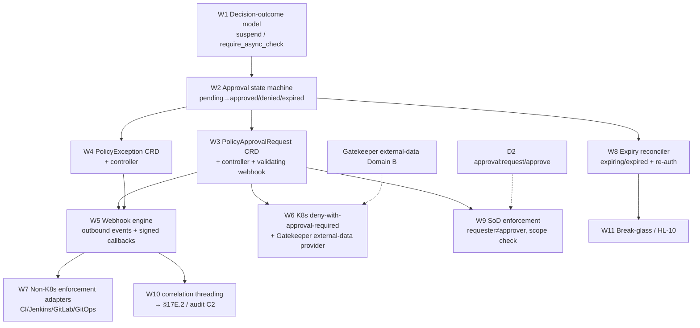

# D3 — Approval-Gated Policy Decisions — PLAN

**Component:** D3 · **Spec:** `SPEC.md` · **Domain:** D · Identity, Authz & Security

---

## 1. Dependency DAG

**Critical path:** W1 → W2 → W3 → W6 (outcome → state machine → CRD → the hard K8s pattern).
W6 is the riskiest/most-valuable: it realizes the §17B.4 admission constraint.

## 2. Parallelizable workstreams
| WS | Starts after | Parallel with |
|---|---|---|
| W1 Decision-outcome model | — | — |
| W2 State machine | W1 | — |
| W3 ApprovalRequest CRD+controller | W2 | W4 |
| W4 Exception CRD+controller | W2 | W3 |
| W5 Webhook engine (out + callbacks) | W3, W4 | W6 |
| W6 K8s deny+external-data provider | W3 | W5 |
| W7 Non-K8s adapters (CI/Jenkins/GitLab/GitOps) | W5 | W8, W9 |
| W8 Expiry reconciler + re-auth | W2 | W7, W9 |
| W9 SoD enforcement | W3 + D2 contract | W7, W8 |
| W10 Correlation threading → audit | W5 | W11 |
| W11 Break-glass | W8 | W10 |

**Two fronts after W3:** K8s admission (W6) and webhook/adapters (W5→W7). W4 (Exception) and
W8 (expiry) run alongside.

## 3. Milestones
- **M1 — Outcomes + state machine:** W1+W2 → `suspend_pending_approval`/`require_async_check`
  semantics; pending→approved/denied/expired transitions modeled.
- **M2 — CRD + K8s pattern:** W3+W6 → DT-59/DT-65 pass end-to-end: deny-with-reason, idempotent
  CR, external-data re-eval, retry→allow, one correlation_id across the chain.
- **M3 — Webhooks + non-K8s + exceptions:** W4+W5+W7 → DT-58/DT-60/DT-61, DT-67 pass; signed
  idempotent callbacks; CI/Jenkins/GitLab/GitOps adapters.
- **M4 — Expiry, re-auth, break-glass, SoD:** W8+W9+W10+W11 → DT-62/HL-19/HL-10 pass; SoD
  rejects self-approval; correlation threaded into §17E.2.

## 4. Test strategy

### 4.1 K8s admission constraint (the headline)
- **Never-blocks test:** measure admission latency for `suspend_pending_approval` — must return
  within the webhook deadline with `deny reason=approval-required`, **never** time out (§17B.4).
- `failurePolicy: Fail` asserted on approval-gate constraints (deny on uncertainty; never Ignore).
- Idempotent CR: 5× `kubectl apply` while pending ⇒ exactly **one** pending CR, no webhook spam.
- External-data freshness: after callback `approved`, retry within provider-poll-interval ⇒
  admit; before refresh ⇒ still deny (documented "approved but not yet effective").
- Correlation: single audit query by `correlation_id` returns deny → CR create → requested →
  granted → admit (DT-65 step 7).

### 4.2 State-machine + CRD immutability
- Controller-only status writes; user `spec` edit / delete rejected by validating webhook (D3-R1).
- `approved` honored only within `expires_at`; post-expiry ⇒ re-block (D3-R4).
- Approval bound to resource spec digest; changed image ⇒ approval not honored (D3-R3, OQ-3).

### 4.3 Webhook contract
- Outbound at-least-once + retry; lost outbound ⇒ approval still grantable via Console (D3-R8).
- Inbound callback **auth**: unsigned/forged callback rejected (D3-R9).
- Inbound **idempotency**: replayed callback doesn't double-transition; callback on terminal CR
  rejected (D3-R10).
- Callback `approved_by` must satisfy D3-R6 (authorized approver, not requester).

### 4.4 Separation of duties (joint with D2)
- Requester == approver ⇒ **rejected** (self-approval).
- Approver lacking `approval:approve` for scope ⇒ rejected.
- Required approver derived from control metadata, not requester-chosen (D3-R7).

### 4.5 Non-K8s adapters
- DT-60 Jenkins stage pauses (input/external-webhook gate) → resumes on grant.
- DT-61 GitOps: Argo Application `Suspended/OutOfSync reason=approval-required` → syncs on grant.
- DT-58 generic deploy suspend; GitLab MR blocked-merge.

### 4.6 Expiry / re-auth / break-glass
- DT-62/HL-19: `approval.expiring` at T-warn; re-auth creates linked request; prior approvals
  retained; scope-tightening honored.
- HL-10 break-glass: shorter TTL, distinct audit tag, mandatory post-hoc review surfaced in
  §17E; still SoD unless declared emergency role.

## 5. Concurrency summary
- **Day-0:** W1→W2 sequential (small); then W3/W4 parallel.
- **Highest-risk parallel item:** W6 external-data provider — its **poll interval vs user retry
  expectation** is the subtle correctness/UX knob; co-design with Domain B (Gatekeeper).
- **Cross-component:** W9 SoD needs D2's `approval:approve` scope semantics + the mutual-exclusion
  fix (D2 adversarial A5); W10 needs C2's audit-event shape and `correlation_id` field; W6 needs
  Gatekeeper external-data (Domain B).
- **Reusable machinery:** `PolicyApprovalRequest` and `PolicyException` share the controller
  framework, webhook engine, and expiry reconciler — build once, parameterize.
