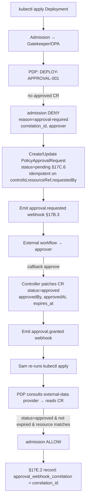

# D3 — Approval-Gated Policy Decisions — SPEC

**Domain:** D · Identity, Authz & Security
**Spec sources:** §17B (Approval-Gated Policy Decisions), §17B.2 decision outcomes,
§17B.3 webhook schema, §17B.4 enforcement-point behavior, §17C.6 (CRD extension pattern:
`PolicyApprovalRequest`, `PolicyException`), §17C.3 action taxonomy (`suspend`)
**Scenarios exercised:** DT-58, DT-59, DT-60, DT-61, DT-62, DT-65, DT-67, HL-04, HL-10, HL-19
**Status:** AUTHORED (parent-authored)
**Author persona:** Marcus (Platform Security Engineer) + Sam (Developer, requester) viewpoint

---

## 1. Scope

### 1.1 In scope
D3 owns the machinery for policy decisions that are **not** immediate allow/deny — decisions
that **defer to an approval** by a person, role, group, org, automated check, or external
workflow (§17B.1). Specifically:

1. The two non-terminal decision outcomes: **`suspend_pending_approval`** and
   **`require_async_check`** (§17B.2), and their semantics relative to the terminal outcomes
   (`allow/deny/warn/mutate`).
2. The **approval state machine** (pending → approved/denied/expired) and where it lives:
   the `PolicyApprovalRequest` / `PolicyException` **CRDs** (§17C.6) as the platform-side
   authoritative approval state.
3. The **workflow webhook** contract (§17B.3): `approval.requested / granted / denied /
   expiring / expired` events; request/response (callback) schema; correlation.
4. The **per-enforcement-point behavior matrix** (§17B.4) — and especially the
   **Kubernetes-admission constraint**: admission webhooks have short deadlines and **cannot
   block on human approval**, so the pattern is **deny-with-approval-required + create/poll a
   CRD + retry**.
5. **Expiry, re-authorization, and break-glass** flows (DT-62, HL-19, HL-10).
6. The **separation-of-duties** tie to D2 (requester ≠ approver) and the approval audit trail.

### 1.2 Out of scope
- **External workflow execution** itself (§17B.3: "External workflow execution is out of
  scope") — D3 emits/receives webhooks; it does not run ServiceNow/Jira.
- Producing the subject (D1) or deciding *who may request/approve* (D2 owns
  `approval:request`/`approval:approve`); D3 *runs the gate* given those permissions.
- The runtime policy *logic* that returns `suspend_pending_approval` (Domain B authoring); D3
  defines what that outcome *means* and how it's resolved.

### 1.3 Load-bearing constraint
> **A Kubernetes admission webhook must never hold the request open waiting for human
> approval** (§17B.4). Long-running approval is represented as *platform state* (a CRD), not as
> a held connection. The admission path is fast: deny-with-reason now, approve out-of-band,
> retry later. (DT-59, DT-65.)

---

## 2. Decision outcomes (§17B.2)

| Decision | Terminal? | Meaning | D3 role |
|---|---|---|---|
| `allow` | yes | permit | — (Domain B) |
| `deny` | yes | block | — |
| `warn` | yes | permit + record warning | — |
| `mutate` | yes | modify request/resource | — |
| **`suspend_pending_approval`** | **no** | pause/defer pending approval | **D3 owns resolution** |
| **`require_async_check`** | **no** | trigger an external check before final disposition | **D3 owns resolution** |

### 2.1 `suspend_pending_approval` semantics
The PDP returns this when an action requires sign-off. Resolution is **enforcement-point
specific** (§3). The platform creates/updates an approval record (CRD) and emits
`approval.requested`. The action is **not executed** until an `approved` state exists and is
non-expired; a `denied` state blocks it; an `expired`/absent state re-blocks (fail closed).

### 2.2 `require_async_check` semantics
The PDP returns this when final disposition depends on an **automated** external check (image
scan, license check, attestation verification) rather than a human. The platform invokes the
check (webhook/async job), holds the *platform-side* pending state, and resolves to
`allow`/`deny` when the check returns. Differs from `suspend_pending_approval` in that the
resolver is a **machine check**, not an approver — but it shares the CRD + webhook + retry
machinery. Timeout → fail closed (deny) by default.

---

## 3. Behavior by enforcement point (§17B.4)

| Enforcement point | Feasible behavior | D3 mechanism |
|---|---|---|
| CI/CD pipeline | Pause job / mark manual approval required | pipeline step polls approval state; webhook drives it |
| GitLab merge request | Block merge pending approval | MR status check tied to approval state |
| Jenkins pipeline | Pause stage pending input/webhook | `input` step or external-webhook gate (DT-60) |
| **Kubernetes admission** | **Cannot hold; deny-with-approval-required or intermediate CRD** | **deny + `PolicyApprovalRequest` CRD + external-data re-eval on retry** (DT-59, DT-65) |
| Application OPA integration | App-specific pending state possible | app holds its own pending UX, queries approval state |
| GitOps controller | Suspend sync / hold promotion | mark Application `Suspended/OutOfSync`, reason approval-required (DT-61) |

### 3.1 Why admission webhooks cannot block (the constraint, precisely)
Kubernetes `ValidatingWebhookConfiguration` has a `timeoutSeconds` (1–30, typically ≤10) and
admission is **synchronous and on the critical path** of every `kubectl apply`. Holding the
connection open for human approval would: (a) exceed the deadline → `failurePolicy` decides
(Fail=deny-all, Ignore=admit-all — both catastrophic for an approval gate), (b) tie up
apiserver webhook concurrency, (c) provide no durable record if the connection drops.
**Therefore approval state must be externalized to a CRD and the admission decision must be
immediate.** (§17B.4, DT-59 notes.)

### 3.2 The Kubernetes deny-with-approval-required pattern (canonical, DT-59/DT-65)

Key properties: idempotent CR creation (no duplicate pending CRs for the same
`(controlId, resourceRef, requestedBy)`); the **CR name doubles as `correlation_id`** giving a
single key across deny → CR → webhook → approve → admit; Gatekeeper reads CR state via an
**external-data provider** whose poll interval must be short relative to user retry expectation.

---

## 4. The approval state machine & CRDs (§17C.6)

### 4.1 `PolicyApprovalRequest` lifecycle
```
            create (suspend_pending_approval)
   ┌──────────────────────────────────────────►  pending
   │                                                 │
   │                          approve callback ──────┤────► approved ──(expires_at reached)──► expired
   │                          deny callback   ───────┤────► denied
   │                          expires (no action) ───┘────► expired
```
States: `pending | approved | denied | expired`. Transitions are **controller-only**:
- **D3-R1 (MUST)** Only the controller (reconciling callbacks/timers) may write `status`; user
  edits to `spec` after creation and deletes are **rejected by a validating webhook** — the CR
  is an **immutable audit record** (DT-65 step 8).
- **D3-R2 (MUST)** CR creation is **idempotent** on `(controlId, resourceRef, requestedBy)`; a
  duplicate request reuses the existing `pending` CR (DT-59 step 3).
- **D3-R3 (MUST)** Approval is bound to a **specific resource version/spec**; an `approved` CR
  authorizes only the resource it was granted for. (Open question OQ-3 on spec-drift.)
- **D3-R4 (MUST)** `expires_at` is set at grant; after it passes, the approval is **not honored**
  (fail closed); a fresh approval is required (DT-62, HL-19).

### 4.2 `PolicyException` lifecycle (DT-67, HL-19)
Parallel CRD for *standing* exceptions (e.g. "allow privileged pod in `payments-legacy` until
migration"). States: `PendingApproval → Valid → Expired/Denied`. **D3-R5 (MUST)** runtime
engines treat `phase != Valid` as "exception not in effect" — denies continue until approved
(DT-67 step 2). Re-authorization updates the exception **in place** with new `expiresAt`,
preserving prior approvals (§23 auditability, HL-19 Branch A).

### 4.3 Separation of duties (tie to D2)
- **D3-R6 (MUST)** The approver subject MUST hold `approval:approve` / `exception:approve` for
  the relevant scope (D2 matrix), and MUST NOT be the `requestedBy` subject (requester ≠
  approver). Self-approval is rejected by the controller.
- **D3-R7 (MUST)** Required approver is derived from policy/control metadata
  (`requiredApproval: {type: role|group|person|org, value}`), not chosen by the requester.

---

## 5. Webhook contract (§17B.3)

### 5.1 Outbound event (platform → workflow), `approval.requested`
```json
{
  "event_type": "approval.requested",
  "control_id": "DEPLOY-APPROVAL-001",
  "decision": "suspend_pending_approval",
  "requested_action": "deploy workload",
  "resource": { "kind": "Deployment", "namespace": "payments-prod", "name": "api" },
  "subject": { "sub": "user-123", "groups": ["team-payments"] },
  "approval_required_from": { "type": "role", "value": "production-release-approver" },
  "correlation_id": "deploy-api-payments-prod",   // == CR name (DT-65)
  "expires_at": "2026-05-13T00:00:00Z"
}
```
Event-type vocabulary: `approval.requested`, `approval.granted`, `approval.denied`,
`approval.expiring` (T-warn, DT-62/HL-19), `approval.expired`.

### 5.2 Inbound callback (workflow → platform), resolution
```json
{
  "correlation_id": "deploy-api-payments-prod",
  "decision": "approved",                 // approved | denied
  "approved_by": "carol@corp.example",
  "approved_at": "2026-05-10T12:00:00Z",
  "expires_at": "2026-08-08T00:00:00Z",   // grant-time TTL
  "reason": "release sign-off #4711",
  "signature": "…"                        // see D3-R10
}
```

### 5.3 Webhook normative requirements
- **D3-R8 (MUST)** Outbound webhooks are **fire-and-forget** with at-least-once delivery +
  retry/backoff; the CRD (not the webhook) is the source of truth. A lost outbound webhook
  must not lose approval state.
- **D3-R9 (MUST)** Inbound callbacks are **authenticated** (HMAC/mTLS/signed) and **authorized**
  (the callback's `approved_by` must satisfy D3-R6) — a callback cannot grant approval that the
  caller couldn't grant interactively.
- **D3-R10 (MUST)** Callbacks are **idempotent** on `correlation_id` + decision; replayed
  callbacks do not double-transition. A callback for an already-terminal CR is rejected.
- **D3-R11 (MUST)** `correlation_id` threads the entire chain (deny → CR → requested → callback
  → granted → admit) and is recorded in the §17E.2 enforcement record as
  `approval_webhook_correlation` (DT-59 step 7, DT-65 step 7).
- **D3-R12 (SHOULD)** Webhook endpoints are configured by Workflow Integrator (D2 role 9) but
  **allow-listed/approved** (cross-ref D2 adversarial A8 — endpoints are a data-egress surface).

---

## 6. Expiry, re-authorization, break-glass

- **Expiry reconciler** scans active CRs; at `expires_at - warn_window` emits
  `approval.expiring`; at `expires_at` transitions to `expired` and emits `approval.expired`
  (DT-62, HL-19 step 1). Expired ⇒ next enforcement re-blocks (fail closed).
- **Re-authorization** creates a new `PolicyApprovalRequest` linked to the original
  `correlation_id` / the existing `PolicyException`; approver may tighten scope; prior approvals
  retained (HL-19 Branch A).
- **Break-glass (HL-10):** an emergency-exception path with **shorter TTL, mandatory
  post-hoc review, and elevated audit tagging**; break-glass approvals are flagged distinctly
  and surface in §17E reports. Break-glass is still requester≠approver (D3-R6) unless a declared
  emergency role overrides with mandatory retrospective sign-off.

---

## 7. Failure modes
| Failure | Behavior |
|---|---|
| Approval state absent at enforcement | **Deny** (fail closed) — never default-allow |
| External-data provider stale (admission can't see fresh `approved`) | User retry returns deny until provider refreshes; provider poll interval bounded; surface "approved but not yet effective" in Console |
| `failurePolicy` triggered (webhook timeout) on admission | Constraint must use `failurePolicy: Fail` for approval gates (deny on uncertainty), never `Ignore` |
| Duplicate `kubectl apply` while pending | Reuse pending CR (D3-R2); no duplicate webhook spam |
| Callback for expired/terminal CR | Reject (D3-R10) |
| Self-approval attempt | Reject (D3-R6) |
| Webhook endpoint unreachable | Retain CR pending; retry outbound; approval still grantable via Console directly |
| Resource spec changed after approval | Approval not honored for the new spec (D3-R3); re-request |
| Controller down | New requests still deny (fail closed); existing approvals honored only if within TTL and reconciler can verify — degrade to deny if unverifiable |

---

## 8. Dependencies
| Depends on | For |
|---|---|
| D1 | `subject` block in webhook/CRD |
| D2 | `approval:request`/`approval:approve` permissions + requester≠approver SoD |
| §17C.6 CRDs + controllers | Approval state representation |
| Gatekeeper external-data (Domain B) | Admission re-eval reads CR state |
| §13.3 audit (C2) | `correlation_id` threading, approval events |
| §17E reporting | Suspended/pending/expiring views (HL-19, HL-10) |

---

## 9. Open questions — decided defaults
| # | Question | Decided default | Rationale |
|---|---|---|---|
| OQ-1 | `suspend_pending_approval` on admission: deny-with-reason or intermediate CRD? | **Both** — deny *and* create CRD; CRD is durable state, deny is the immediate disposition. | §17B.4 + DT-59/DT-65. |
| OQ-2 | CR name vs separate correlation_id? | **CR name == correlation_id.** | One key across all systems (DT-65). |
| OQ-3 | Does approval bind to exact resource spec/digest? | **Yes — bind to resource ref + spec digest**; spec change ⇒ re-request. | Prevents approve-then-swap-image abuse. |
| OQ-4 | `require_async_check` timeout disposition? | **Deny (fail closed)** by default; per-control override allowed. | Safe default for an approval gate. |
| OQ-5 | Are approvals revocable before expiry? | **Yes** — approver/admin may revoke (status→denied); next enforcement re-blocks. | Incident response. |
| OQ-6 | Break-glass self-approval? | **No** except a declared emergency role with mandatory post-hoc review. | SoD preserved (HL-10). |
| OQ-7 | Webhook delivery guarantee? | **At-least-once + idempotent callbacks; CRD authoritative.** | Lost webhook ≠ lost approval (D3-R8/R10). |
