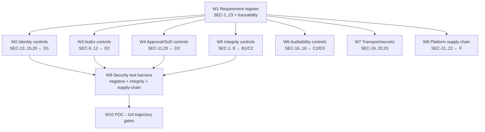

# D4 — Security Requirements — PLAN

**Component:** D4 · **Spec:** `SPEC.md` · **Domain:** D · Identity, Authz & Security

D4 is a **cross-cutting requirements + verification** component: it does not ship a single
service but defines the numbered controls (SEC-1..23) that D1/D2/D3 and other domains implement,
plus the test harness that proves them.

---

## 1. Dependency DAG

**Critical path:** W1 → (W2..W8 in parallel) → W9 → W10. W1 (the register + traceability) must
land first so every other component can map its controls to SEC-n.

## 2. Parallelizable workstreams
All of W2–W8 are **independent** once W1 exists; each is co-owned with the implementing
component/domain. W9 (the harness) aggregates their tests; W10 defines the hardening gates.

| WS | Co-owner | Parallel | Blocks |
|---|---|---|---|
| W1 Requirement register + traceability | D4 | — | all |
| W2 Identity controls | D1 | W3–W8 | W9 |
| W3 Authz controls | D2 | W2,W4–W8 | W9 |
| W4 Approval/SoD controls | D3 | … | W9 |
| W5 Integrity (bundles/evidence) | B1, C2 | … | W9 |
| W6 Auditability | C2, D3 | … | W9 |
| W7 Transport/secrets | F | … | W9 |
| W8 Platform supply chain | F | … | W9 |
| W9 Security test harness | D4 | — | W10 |
| W10 POC→GA gates | D4 | — | — |

## 3. Milestones
- **M1 — Register + traceability:** W1 → SEC-1..23 published; each component links its
  requirements to SEC-n (feeds cross-cutting TRACEABILITY.md).
- **M2 — Floor controls verified:** W2+W3+W4+W6 → POC-MUST controls (SEC-9,10,11,13,16,17,18,20,
  22,23) have passing tests.
- **M3 — Integrity + transport:** W5+W7 → bundle versioning/verification interface, evidence
  hashing, TLS floor, secrets management.
- **M4 — Supply chain + GA gates:** W8 platform SBOM/signing; W10 documents the POC→GA trajectory
  with explicit gates (SEC-2/8/19/21 hardening).

## 4. Test strategy (security tests are the deliverable)

### 4.1 Identity (SEC-13..15, 20)
- `alg:none`, RS/HS confusion, wrong `aud`/`azp`, non-exact `iss`, expired/`nbf`-future,
  unpinned-alg ⇒ **all rejected** (D1 §4.2 reused).
- Stale privileged token after deprovision ⇒ high-value op re-checks grant store and denies.
- Mapping edit attempt by non-admin ⇒ denied + audited.

### 4.2 Authz (SEC-9..12)
- **The D2 §4.2 scope-escape suite is the SEC-9/SEC-10 acceptance** (caller-independent denial).
- SoD: self-approval rejected; author≠enforce-promoter; **mutual-exclusion** on author+approver
  roles for same scope (SEC-11).
- Admin verbs audited; (GA) dual-control gate (SEC-12).

### 4.3 Integrity (SEC-1..8)
- Tampered bundle ⇒ verification fails ⇒ rejected (fail closed).
- Bundle scope altered ⇒ version/signature invalid (SEC-3).
- Replay reproducibility: same digest ⇒ same result (HL-18).
- Export pre-redaction `original_hash` present + matches (DT-57).
- Audit tamper-evidence: mutate a stored event ⇒ hash mismatch detected; (GA) chain checkpoint
  detects in-window tampering (SEC-8).

### 4.4 Auditability (SEC-16..18)
- Edit/sim/approve/promote/mapping/grant/export each produce an audit record with actor +
  before/after + correlation_id.
- `authz_denied` + `boundary_crossing` emitted (D2 tests reused).
- Audit scope-aware yet complete (auditor sees in-scope, no gaps).

### 4.5 Transport / secrets (SEC-19, 20, 23)
- Subject + approval-callback channels reject plaintext / unauthenticated peers.
- No secret/raw-token/PII in any log (scrub assertion across components).

### 4.6 Supply chain (SEC-21, 22)
- Platform image unsigned / no SBOM ⇒ deploy verification fails (GA gate).
- Controller/webhook RBAC is least-privilege (no `cluster-admin`); CRD-immutability webhook
  cannot be bypassed.

## 5. Concurrency summary
- **Maximally parallel:** after W1, every control workstream proceeds inside its owning
  component; D4's job is to keep the register authoritative and aggregate tests in W9.
- **Reused suites:** D1 §4.2 and D2 §4.2 are *the* acceptance tests for SEC-13 and SEC-9/10 —
  D4 doesn't duplicate, it references and gates on them.
- **Trajectory discipline:** W10 makes the POC→GA hardening (SEC-2/8/19/21) explicit gates so
  the "should" controls don't silently never-harden.
