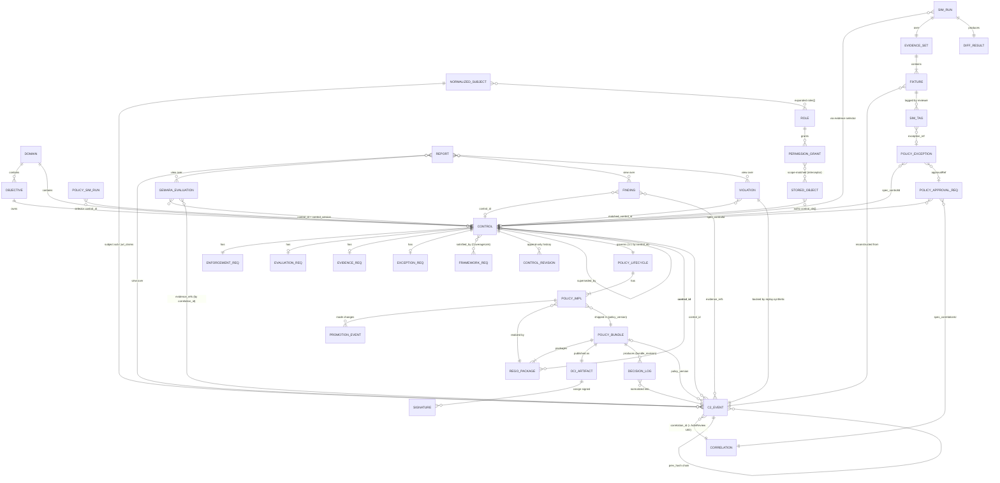

# Unified Data Model — Cross-Cutting Entity / Relationship Model

**Scope:** the platform-wide entity and relationship model that unifies all six domains
(A governance core, B policy engines, C evidence/audit/analytics, D identity/authz, E
simulation/console, F platform). It is a *reconciliation* document: it does not re-specify any
component, it stitches the component data models together through the shared join keys, names the
referential-integrity invariants that must hold across components, and resolves the points where
domains drifted in naming.

**Authoritative sources** (each entity is *owned* by exactly one component; this doc never overrides
an owner): A1 `SPEC.md` (Gemara hierarchy), A2 `SPEC.md` (policy lifecycle), B1 `SPEC.md` (Rego/bundles),
B4 `SPEC.md` (CRDs + action taxonomy), C1 `SPEC.md` (Privateer evaluations), C2 `SPEC.md`
(**FROZEN** `c2.audit-event/1.0`, 36 fields — canonical, not altered here), C3/C4 `SPEC.md`
(findings/violations), C5 `SPEC.md` (reports), D1 `SPEC.md` (subject/claims), D2 `SPEC.md`
(roles/permissions/scope), D3 `SPEC.md` (approval state), E1 `SPEC.md` (simulation), E2 `SPEC.md`
(lineage graph/console).

**The one sentence the whole model hangs on:** `control_id` is the universal join key minted only by
A1 (A1 D3), and every downstream artifact — Rego package, bundle, Gatekeeper constraint, audit event,
exception CRD, simulation fixture, Gemara evaluation, finding, report row — references a Control through
it. `correlation_id` (C2, = Kubernetes Admission Review UID) is the universal *per-request* join key.

---

## 0. Naming reconciliations (drift resolved here)

Where domains drifted, the **canonical** name is fixed below; the drift is noted so readers of the
source SPECs can map. These are the only renamings the unified model imposes; component SPECs keep
their local text but MUST read through this table at integration boundaries.

| # | Concept | Canonical name | Drift observed (component → its spelling) | Resolution rule |
|---|---|---|---|---|
| R1 | Replay fidelity middle state | **`best_effort`** | C2 §13.3 table once said `partial`; E1 fixture/table uses `partial`; C1 rollup uses `best_effort`; C2 API accepts `partial` as alias | C2 D-C2-01 is authoritative: middle state = `best_effort`; `partial` is a **deprecated ingest/query alias** the normalizer rewrites. Everywhere E1 says `replay_completeness=partial`, read `best_effort`. (Note: `jwt_claims_completeness=partial` is a *different* field and keeps `partial`.) |
| R2 | The governance domain of a control | **`policy_domain`** (the scope dimension) backed by `domain_id` (the A1 entity key) | A1: `owning_domain_id` / `domain_id`; D1/D2: `policy_domains[]`; B1 metadata: `__governance_domain__` / `custom.governance_domain`; E2 node: `governance_domain` | A1 `domain_id` is the **entity identifier**; `policy_domain` is the **scope-dimension name** used by D1/D2/C2 `scope`. They carry the same values. B1's `__governance_domain__` and E2's `governance_domain` are the same dimension; treat as `policy_domain`. |
| R3 | Candidate vs prior bundle in a diff | **`candidate_bundle`** / **`baseline_bundle`** | B4 CRD: `candidateBundle`/`baselineBundle`; E1 entity/CRD: `new_bundle`/`previous_bundle`, `newBundle`/`previousBundle` | Canonical pair = `candidate_bundle` (the proposed new one) / `baseline_bundle` (the prior). E1's `new_bundle`≡`candidate_bundle`, `previous_bundle`≡`baseline_bundle`. Same digests, same `policy_version` namespace. |
| R4 | Normalized actor identity | **`subject`** object; its principal id is **`subject.sub`** | D1 canonical subject uses `subject_id` (= `sub`); C2 `subject.sub`; D2 `subject_id`; CRDs `subject.sub` / `requestedBy` | C2's `subject` object shape is canonical for events; D1's `subject_id` == C2 `subject.sub` == the JWT `sub`. `requestedBy` (B4) == `subject.sub`. |
| R5 | Bundle/policy identity used by a decision | **`policy_version`** (string: `bundle:vN` or OCI `sha256:…` digest) + structured **`policy_ref`** | B1: `bundle_revision` (`<semver>+<git-sha>`) and OCI `digest`; A2: `policy_version`; C2: `policy_version` + `policy_ref`; A1 mirror: `current_policy_version` | `policy_version` is the cross-platform string. B1's `bundle_revision` is the *value* that populates it for OPA; the OCI `digest` is the addressable form production pins to (B1-R16). A2 is the **authority** for `current_policy_version`; A1 mirrors it read-only (A2 OQ-4). |
| R6 | Two lifecycles, two status words | A1 **governance status** (`draft/in_review/active/deprecated/retired`) vs A2 **enforcement mode** (`draft/dry-run/warn/enforce/suspend_pending_approval/deprecated`) | A1 D7 / A2 D5 deliberately keep them separate; both call their field `status` | Never collapse. `Control.status` = governance; `PolicyImplementation.mode` = enforcement posture. A2 owns the reconciler between them (A2 §8). |
| R7 | The "deny but route to approval" state | action **`require_approval`** + admission disposition **deny-pending-approval** | B4 action enum `require_approval`; D3 `suspend_pending_approval`; C2 `decision` enum has both `suspend_pending_approval` and `require_approval` | They are distinct and both valid: `require_approval` = admission realizes as deny + CRD (R-B4-6); `suspend_pending_approval` = a PDP that *can* hold (CI/app/GitOps) pauses. The CRD `phase` is the authoritative resolution either way. |

---

## 1. Entity catalog

First-class entities across all domains. **ID** is the primary identifier; **Owner** is the sole
component that may create/mutate the entity; **Join keys** are the cross-component foreign keys it
carries.

### A — Governance core

| Entity | Owner | ID | Key attributes | Join keys carried |
|---|---|---|---|---|
| **Domain** (Policy Domain) | A1 | `domain_id` (slug) | title, owner (RoleRef), parent_domain_id, status | — (referenced by Objective/Control as `owning_domain_id`; = `policy_domain` scope value) |
| **Objective** | A1 | `objective_id` (`OBJ-…`) | title, rationale, risk_rating, status | `owning_domain_id`, `framework_refs[]` |
| **Control** | A1 | **`control_id`** (e.g. `SC-IMG-001`) — *the universal join key* | title, statement, severity, applicability, enforcement_class, enforcement_targets[], required_jwt_claims[], status (governance), superseded_by, current_policy_version (mirror) | `owning_objective_id`, `owning_domain_id`, `evidence_schema_ref`, `exception_workflow_ref`, `related_rego_package` |
| **EnforcementRequirement** | A1 (child of Control 1:1) | `ENF-<control_id>` | mode_intent, enforcement_point, engine, deterministic | `control_id` (embedded in id) |
| **EvaluationRequirement** | A1 (child 0..1) | `EVAL-<control_id>` | method, signal_description, cadence | `control_id`, `source_audit_query`, `privateer_evaluation_id` |
| **EvidenceRequirement** | A1 (child 0..1) | `EVID-<control_id>` | required_core_fields[] (⊇ `AUDIT_CORE_FIELDS@ver`), control_specific_fields[], retention_min_days | `control_id` |
| **ExceptionRequirement** | A1 (child 0..1) | `EXC-<control_id>` | approver_role, max_duration_days, required_linked_artifacts[], scope, sod flag | `control_id` (read by PolicyException validator) |
| **FrameworkRequirement** | A1 | `framework:requirement` (e.g. `SOC2:CC6.1`) | text, domains[] | — |
| **CoverageLink** | A1 | (framework_ref, control_id) | coverage (full/partial), rationale, bidirectional | `control_id`, `framework_ref` |
| **ControlRevision** | A1 | ULID | append-only snapshot of a Control | `control_id` |
| **LineageEdge** | A1 | `edge_id` (ULID) | edge_type, valid_from/valid_to (temporal), created_by | `from_ref`/`to_ref` typed node refs (`control:`, `rego:`, `bundle:`, `constraint:`, `framework:`, `decision:<correlation_id>`) |
| **PolicyLifecycle** | A2 | `lifecycle_id` (ULID) | enforcement_class (mirror), current_mode, status, current_policy_version (**authority**) | **`control_id`** (1:1) |
| **PolicyImplementation** | A2 | `impl_id` (ULID) | engine, enforcement_point, mode, generated_from, constraint_name, target_selector | `control_id` (via lifecycle), `rego_package`, `bundle_ref`+digest, `policy_version` |
| **PromotionEvent** | A2 | `event_id` (ULID) | from/to mode, from/to version, actor, reason, gate_results | `control_id`, `lifecycle_id`/`impl_id`, `approval_ref` (→ approval `correlation_id`), `simulation_report_ref`, **`correlation_id`** |
| **GenerationDecision** | A2 | (per impl) | mode (full/template), template_todos[], prefilled_metadata | `impl_id`, `control_id` |

### B — Policy engines

| Entity | Owner | ID | Key attributes | Join keys carried |
|---|---|---|---|---|
| **RegoPackage** | B1 | `package` path (`governance.<product>.<capability>`) | `__control_id__`, `__severity__`, `__required_claims__`, METADATA block, entrypoints, replay_schema_ref | **`control_id`** (== `__control_id__` == `custom.control_id`, must match) |
| **PolicyBundle** | B1 | `bundle_id` + `version` (semver) + `revision` (`<semver>+<git-sha>`) | manifest, control_ids[] (sorted), git_provenance | `control_ids[]`; the `revision` populates `policy_version` |
| **OCIArtifactRef** | B1 | `digest` (sha256) | registry, repository, tag | (1:1 PolicyBundle) |
| **Signature** | B1 | `signature_digest` | rekor_log_index, cert_identity, attestation_predicate | OCIArtifactRef digest |
| **DecisionLog** | B1 | `decision_id` (uuid) | bundle_revision, path, input, result (§5 decision obj), nd_builtin_cache | `control_id`, **`correlation_id`**, `policy_version` (via bundle_revision), `subject` |
| **Action (taxonomy)** | B4 | enum value (1 of 13, **closed**) | semantics, allowed-at, side-effect | referenced by B1 `decision.action`, C2 `action_performed`/`decision` |
| **PDP profile** | B4 | (product) | §17C.4 class, replay-capable flag, the 8 §17C.5 definitions | — |
| **PolicyApprovalRequest** (CRD) | B4 (state) / D3 (semantics) | `metadata.name` | requestedBy, requiredApproval{type,value}, resourceRef, expiresAt, **status.phase** (pending/approved/rejected/expired/consumed), decisions[] | **`spec.controlId`**, **`spec.correlationId`** (= denied admission UID), `consumedBy.admissionReviewUID`, `subject` |
| **PolicyException** (CRD) | B4 | `metadata.name` | scope{namespaces,resources}, reason, grantedBy, expiresAt, status.phase (active/expired/revoked), usageCount | **`spec.controlId`**, `approvalRef` |
| **PolicySimulationRun** (CRD) | B4 def / E1 driver | `metadata.name` | mode (M1..M9), evidenceSet selector, requireComplete, status.phase, diff | `control_id` (via selector), `candidate_bundle`/`baseline_bundle` digests, `evidenceSetRef`, `reportRef` |
| **PolicyActionLibrary** (CRD) | B4 | name | per-product action subset → effector map | (feeds E3) |
| **PolicyEvidenceSchema** (CRD) | B4 | name | replay schema per PDP | feeds C2/C4 |
| **PolicyRemediationAction** (CRD) | B4 | name | remediation type, dry-run/armed, evidence | `control_id`, `correlation_id` |

### C — Evidence, audit, analytics

| Entity | Owner | ID | Key attributes | Join keys carried |
|---|---|---|---|---|
| **C2 audit event** (`c2.audit-event/1.0`, **FROZEN 36 fields**) | C2 | **`event_id`** (UUIDv7) | schema_version, timestamp, event_type, decision, policy_engine, replay_completeness, subject, scope, request_object, external_data_refs[], jwt_claims, content_hash | **`correlation_id`**, `parent_correlation_id`, **`control_id`**, **`policy_version`**, `policy_ref`, `resource_id`, **`prev_hash`**, **`chain_seq`** |
| **Correlation (group)** | C2 (derived view) | `correlation_id` | correlation_members {present[], missing_expected[]} | `correlation_id` (= Admission Review UID) |
| **MaterializedDataset / simulation_dataset** | C2 | digest | object_type, control_ids[], scope, visibility, created_by | `control_ids[]`, scope dims |
| **GemaraEvaluation** | C1 | `evaluation_id` (UUIDv7) | control_version, verdict (satisfied/not/partial/indeterminate), coverage, replay_completeness_rollup, integrity{content_hash,prev_hash,chain_seq} | **`control_id`**, scope dims, `evidence_refs[]` (each carries `correlation_id` + C2 `event_id`) |
| **GemaraEvaluationLog** | C1 | (append-only, chained) | per-control evaluation history | `control_id` |
| **Finding** | C3 | `finding_id` (UUIDv7) | type, severity, window, detail, confidence, state (open/ack/resolved/suppressed) | `control_id?`, scope dims, `evidence_refs[]` (= C2 `event_id`/`correlation_id`/coverage cell) |
| **Violation (audit-derived row)** | C4 | (per violation; backed by a `replay.synthetic` C2 event) | violation_timestamp, discovery_timestamp, reconstructed_policy_input, confidence_level, missing_fields[], recommended_remediation | **`matched_control_id`**, `policy_version` (replay bundle), `source_audit_log` (→ C2 `event_id`), `correlation_id` |
| **Report (R1–R4)** | C5 | report id / dataset digest | type, filters, rows (views over C2/C1/C3/C4), signed export manifest | `control_id`, scope dims, `policy_version`, `event_id` per row |

### D — Identity & authz

| Entity | Owner | ID | Key attributes | Join keys carried |
|---|---|---|---|---|
| **NormalizedSubject** | D1 | `subject_id` (= `sub`) | schema_version (`subject/vN`), subject_type, tenants[], namespaces[], policy_domains[], roles[] (expanded), environment, risk_level, claim_provenance, normalization_status | `subject_id` (== C2 `subject.sub`); roles[] resolve into D2 role registry |
| **ClaimMapping** | D1 | (name, version, realm) | entries[] (target/sources/transform), schemaVersion | — (authz-relevant artifact) |
| **Role** | D2 | `role_id` (e.g. `role:namespace-policy-author`) | scope_level, granted_permissions[], implied_roles[] | resolved from NormalizedSubject.roles[] |
| **PermissionGrant** | D2 | (verb, resource_type, scope-selector) triple | verb, resource_type, scope dims | scope dims |
| **ScopePredicate** | D2 (derived per request) | (ephemeral) | tenant ∈ subject.tenants ∧ namespaces ∩ ∧ policy_domains ∩ | scope dims (`cluster, namespace, tenant, policy_domain, control_id`) |
| **Object `authz` block** | D2 (on every stored object) | (embedded) | object_type, cluster, namespaces[], policy_domains[], control_ids[], tenant, created_by, visibility | `control_ids[]`, scope dims |
| **authz_denied / boundary_crossing event** | D2 | (C2 event) | denying_rule_ref, requested_scope | `subject_id`, `correlation_id` |
| **Approval decision/state** | D3 | (lives in PolicyApprovalRequest CRD) | phase, decisions[], SoD (requester ≠ approver) | `control_id`, `correlation_id` |

### E — Simulation & console

| Entity | Owner | ID | Key attributes | Join keys carried |
|---|---|---|---|---|
| **SimulationRun** | E1 | `run_id` | mode (M1..M9), status, authoritative bool, report_ref | `control_id` (via evidence selector), `baseline_bundle`/`candidate_bundle`, `evidence_set_ref` |
| **EvidenceSet** | E1 | `evidence_set_ref` + digest | source_kind, event_count, replay_completeness_histogram, scope | scope dims; sourced from C2 events / datasets |
| **PolicyInputFixture / EvaluatedEvent** | E1 | `event_id` / `fixture_id` | policy_input, external_data_snapshot, replay_completeness, decision_previous/new, classification, tag | **`control_id`**, `correlation_id`, source C2 `event_id`, scope dims |
| **DiffResult** | E1 | (per run) | newly_blocked/allowed, unchanged_*, incomplete, untagged_risky, fp/fn candidates | `run_id` |
| **RegressionFixture** | E1 | `fixture_id` | desired_outcome, bundle_version | **`control_id`**, `policy_ref`, `source_event_id` |
| **SimulationTag** | E1 | (event_id, run_id) | tag, rationale, tagged_by, exception_ref | `event_id`, `run_id`, → PolicyException |
| **Lineage graph node** | E2 (assembled) | per node type | Objective/Control/RegoPackage/EnforcementPoint/AuditEvidence/ApprovalGate/Exception | **`control_id`**, `correlation_id`, `policy_version`, scope dims — all sourced, never owned by E2 |

---

## 2. The shared join keys — how entities reference each other

The platform is held together by a small set of keys. Each is minted by exactly one component and
referenced everywhere else.

### 2.1 `control_id` — the universal governance anchor (minted by A1 only, A1 D3)
The single global namespace and canonical FK across the **entire** platform. No other component may
mint one (A1-MUST-001/D3). The chain of references:

```
A1.Control.control_id
  ← A1 child requirements (ENF-/EVAL-/EVID-/EXC-<control_id>)
  ← A1.CoverageLink.control_id ↔ FrameworkRequirement
  ← A2.PolicyLifecycle.control_id (1:1) → A2.PolicyImplementation → A2.PromotionEvent.control_id
  ← B1.RegoPackage.__control_id__  (== custom.control_id; build fails if they disagree — B1-R1/R2)
  ← B1.PolicyBundle.control_ids[]  (sorted, in .manifest.metadata)
  ← B1.DecisionLog.control_id
  ← B4.PolicyApprovalRequest.spec.controlId / PolicyException.spec.controlId
  ← C2.event.control_id            (field 13; "C" — absent ⇒ C3 ungoverned_enforcement finding)
  ← C1.GemaraEvaluation.control_id (+ control_version pin)
  ← C3.Finding.control_id?         (optional; null for chain-integrity/latency findings)
  ← C4.Violation.matched_control_id
  ← C5 report rows / filters
  ← D2.Object.authz.control_ids[]  (storage scope dimension)
  ← E1.Fixture/Run/RegressionFixture.control_id
  ← E2 graph: Control node, edge `Control --implemented_by--> RegoPackage` (via __control_id__)
```

### 2.2 `correlation_id` — the universal per-request join (minted by C2 normalizer; anchor = K8s Admission Review UID, C2 D-C2-03)
Joins all events of one logical flow. **The Admission Review UID is the only id both Gatekeeper and
embedded OPA see**, so OPA MUST echo it (N-C2-201) — without that echo the join breaks (DT-28).

```
Admission Review UID
  = C2.event.correlation_id (field 3) = engine_context.gatekeeper.admission_review_uid
  = B1.DecisionLog.correlation_id (OPA echoes the inbound UID; keeps decision_id in engine_context.opa)
  = B4.PolicyApprovalRequest.spec.correlationId  (ties the denied admission to the approval)
        → status.consumedBy.admissionReviewUID (single-use consumption, R-B4-13)
  = A2.PromotionEvent.correlation_id (mode-change events on the change feed)
  = D2.authz_denied/boundary_crossing.correlation_id
  = C1.EvidenceRef.correlation_id (the join key for evidence correlation)
  = C3.Finding.evidence_refs (correlation_id form) ; C4.Violation.correlation_id
  = E1.PolicyInputFixture.source.correlation_id
Non-admission anchors (C2 §6.2): CI = ci:<provider>:<run-id> ; app PDP = SDK request id ;
  Keycloak = session/flow id (token-issuance joined to decisions by sub+time ⇒ reconstructed).
  Minted (no upstream anchor) ⇒ engine_context.<sys>.correlation_source="minted" (a C3 finding if it
  should have had one — DT-28).
```

### 2.3 `policy_version` / `policy_ref` — the bundle identity of a decision (A2 is the authority; R5 above)
```
B1.PolicyBundle.revision (<semver>+<git-sha>)  +  OCIArtifactRef.digest (sha256, production pins this)
  → A2.PolicyImplementation.policy_version (per-impl) ; PolicyLifecycle.current_policy_version (head, AUTHORITY)
  → A1.Control.current_policy_version  (READ-ONLY MIRROR of A2; A2 OQ-4)
  → C2.event.policy_version (field 11, "C" required for policy.decision) + policy_ref{rego_package,
       rule, constraint_template, constraint_name} (field 12)
  → E1/B4 differential: baseline_bundle vs candidate_bundle (both digests in the same namespace)
  → C4.Violation.policy_version (the *inferred* replay bundle for a reconstructed event)
  → C3.policy_drift finding: expected vs observed policy_version per cluster (HL-09)
```

### 2.4 `scope` (the D2 dimensions) — `{cluster, namespace, tenant, policy_domain, control_id}`
The same five dimensions appear as: C2 `scope{cluster,namespace,tenant,region,environment}`
(field 23), D2 object `authz` block, D1 subject `{tenants[],namespaces[],policy_domains[]}`, A1
`Applicability`, C1/C3/C4 `scope`. D2's interceptor matches **subject scope ∩ object scope** by
*intersection, not string containment* (D2 §3.4). See §6 for the full storage-scope column map.

### 2.5 `event_id` / `chain_seq` / `prev_hash` — audit identity & tamper-evidence (C2)
`event_id` (UUIDv7, time-sortable) is the per-event PK. `chain_seq` (monotonic per source) +
`prev_hash` (= prior event's `content_hash`) form the per-source append-only hash chain; a gap or
mismatch is detectable tampering (C3 `chain_integrity` finding). C1's GemaraEvaluation and C5's
exports reuse the **same** integrity primitive (C2 §7.6) — one signing format platform-wide (C1 D-C1-03,
C5: "C5 assembles content, C2 signs").

### 2.6 CRD names (B4) — durable state for what engines can't do synchronously
CRDs are addressed by `metadata.name` and all live in group `governance.example.io/v1alpha1`:
`PolicyApprovalRequest`, `PolicyException`, `PolicySimulationRun`, `PolicyActionLibrary`,
`PolicyEvidenceSchema`, `PolicyRemediationAction`. Each carries `spec.controlId` and emits C2 events
with `correlation_id` on every state transition (R-B4-23). The `status.phase` field is the
authoritative approval/exception state (D3) — *not* the `deployment_approval` JWT claim (D1 OQ-6: claim
is a cache hint at most).

---

## 3. ER diagram (core entities)



---

## 4. Cardinality & lifecycle notes

| Relationship | Cardinality | Lifecycle note |
|---|---|---|
| Domain → Objective → Control | 1→N→N | A control names **exactly one** owning objective (A1 OQ-5; many-to-many handled by CoverageLink, not the tree). |
| Control → child requirements | 1→1 (Enforcement), 1→0..1 (Eval/Evidence/Exception) | Owned children, not shared instances (A1 D1); reuse via templates that *clone*. |
| Control → PolicyLifecycle | **1→1** (keyed by `control_id`) | A2 lifecycle is created on A1 `ControlActivated`; reconciled on `ControlDeprecated`. |
| Control → PolicyImplementation | 1→N | One control may have many impls (per engine / per cluster selector); different clusters may sit at different `mode`s (A2 OQ-3); aggregate `current_mode` = most-conservative. |
| Control → **policy versions** → decisions | 1→N→N | **One Control → many signed `policy_version`s → many decisions.** DT-05 alone yields three versions (dry-run/warn/deny). Each version produces many C2 events. |
| PolicyImplementation → PromotionEvent | 1→N | Append-only, ordered, immutable trail (A2-MUST-041). Promotions gated; demotions ungated/instant (A2 D4). |
| Control governance status vs enforcement mode | parallel, linked by events | A control can be `active` (governance) while its enforcement is still `dry-run`; mismatch past SLA ⇒ A2 `governed_not_enforced`; live impl on a `retired` control ⇒ `zombie_enforcement` (critical). |
| RegoPackage → Control | N→1 | Many packages may implement one control across engines; each MUST carry the matching `__control_id__` (B1-R1). |
| PolicyBundle → RegoPackage | 1→N | Per-governance-domain bundles with explicit roots (B1 OQ-7); pinned by digest in prod. |
| **AdmissionReview UID → C2 events** | **1→N** | **One Admission Review UID → many audit events** (a Gatekeeper decision event + an OPA decision echo + a K8s-API resource-change event), all sharing `correlation_id` (C2 §2). Absence of an expected member = bypass/correlation-gap signal. |
| C2 event → GemaraEvaluation | N→1 (rollup) | One evaluation rolls up many events for `(control_id, scope, period)`; pinned to `control_version` — a mid-period control change **splits** the period into two evaluations (C1 D-C1-04). |
| PolicyApprovalRequest → admission | 1→1, single-use | One approved request authorizes exactly one admission (matched by correlationId+resourceRef+subject); second use rejected (R-B4-13); `expired`/`consumed` cannot be reused. |
| PolicyException → decisions | 1→N (within scope) | Bounded (`expiresAt` required) + scoped; expiry flips controls back to enforcing (R-B4-15); each use counted (`usageCount`). |
| SimulationRun → EvidenceSet → Fixture | 1→1→N | Run immutable once `Succeeded`; re-runs create a new run; tags mutate `SimulationTag`, never the run's decision facts. |
| C4 Violation → C2 event | 1→1 | Each reconstructed violation is backed by a `replay.synthetic` C2 event capped at `best_effort` (N-C2-SYNTH / N-C4-1). |
| NormalizedSubject → roles → permissions | 1→N→N | Roles additive; effective permission = union ∩ scope (D2 §2). Token scope is an assertion validated against the server-side grant store for privileged ops (D2 OQ-6). |

---

## 5. Cross-domain consistency rules (referential-integrity invariants)

These MUST hold across components; each is enforceable and most map to a named requirement.

1. **CI-1 control_id resolves.** Every `control_id` appearing in a C2 event, B1 bundle, Gatekeeper
   constraint, exception/approval CRD, Gemara evaluation, finding, violation, or report row MUST
   resolve to an A1 Control that exists (incl. `retired`). B1 fails the build on unknown control_id
   (B1-R2); a Rego claiming a non-existent control ⇒ A1 `orphan_implementation` (A1 F9); a C2 event
   with no `control_id` where one is expected ⇒ C3 `ungoverned_enforcement`.
2. **CI-2 control_id is never minted elsewhere and never reused.** Only A1 allocates; deletion is
   forbidden once a control emitted any decision/evidence; the only removal path is
   `deprecated → retired`, preserving the id forever (A1-MUST-001/003, D3).
3. **CI-3 EvidenceRequirement ⊇ AUDIT_CORE_FIELDS.** Every Control's `required_core_fields` MUST be a
   superset of `AUDIT_CORE_FIELDS@<schema_version>` (the C2 §13.3 floor imported as a versioned
   constant); A1 rejects a save that drops `correlation_id`/`policy_version`/etc. (A1-MUST-010/D4).
   A C2 schema_version bump that under-specs existing controls ⇒ A1 `evidence_drift` flag (A1 F5).
4. **CI-4 policy_version authority & mirror.** A2 (`PolicyLifecycle.current_policy_version`) is the
   sole authority; A1's `Control.current_policy_version` is a read-only mirror (A2 OQ-4). On
   divergence, the **signed bundle digest is authoritative** (A2 F9). Because one control may run at
   different modes/versions per cluster, `policy_version` is effectively **multi-valued per control
   per cluster** — drift between expected and observed per cluster is a first-class C3 `policy_drift`
   finding (HL-09).
5. **CI-5 correlation_id echo.** Embedded OPA MUST echo the inbound Admission Review UID into
   `correlation_id` (N-C2-201); a `policy.decision` carrying a *minted* correlation_id that should have
   had an anchor is itself a finding (DT-28). Approval/exception consumption matches on
   `correlationId + resourceRef + subject` (R-B4-13).
6. **CI-6 replay_completeness honesty (no silent promotion).** A `replay.synthetic` event MUST NOT be
   `complete` (N-C2-SYNTH); an `insufficient` event MUST NOT be promoted to a verdict
   (N-C2-NOPROMOTE); Privateer MUST NOT render `satisfied` over `insufficient` evidence
   (N-C1-6 ⇒ `indeterminate`); E1 marks results over non-`complete` events advisory/incomplete, never
   authoritative (§17.3); C5 excludes `insufficient` from authoritative counts (N-C5-4). All read the
   **single** canonical state set `complete | best_effort | insufficient` (R1 above).
7. **CI-7 metadata agreement.** A Rego package's `__control_id__` variable and its `# METADATA`
   `custom.control_id` MUST be equal, or the bundle build fails (B1-R1). `custom.severity` /
   `enforcement_classes` MUST be valid enum subsets (B1-R3/R4) consistent with the A1 Control's
   `severity` / `enforcement_class`.
8. **CI-8 action vocabulary is closed.** Every engine result maps to exactly one of the 13 B4 actions;
   an unknown/ad-hoc action is rejected (R-B4-5); B1's `decision.action` draws from B4, never
   redefines it (B1-R9).
9. **CI-9 bounded & scoped waivers.** Every PolicyException and PolicyApprovalRequest MUST carry a
   bounded `expiresAt` (R-B4-11/15); an unbounded or unscoped exception is rejected; expiry re-blocks
   (fail-closed). Approval authoritative state is the CRD `status.phase`, **not** the
   `deployment_approval` JWT claim (D1 OQ-6).
10. **CI-10 separation of duties.** `requestedBy != approver` on approvals (R-B4-12); `policy:promote-enforce`
    / `*:approve` verbs are approver-only roles distinct from authoring (D2 §4); A2 enforces SoD via
    JWT group on `*→enforce` (A2-MUST-040).
11. **CI-11 storage scope is enforced server-side.** No code path reaches storage without the D2 scope
    rewrite (D2-R3); out-of-scope by explicit filter ⇒ 403-no-data, by ID ⇒ 404 (D2-R4/R6); counts and
    cursors computed over the filtered set (D2-R5). Every stored object carries an immutable `authz`
    block set at write time and the author cannot claim a wider scope than they hold (D2-R1/R2).
12. **CI-12 tamper-evidence is one format.** C2's per-source hash chain + signed Merkle checkpoints +
    export envelope (C2 §7) is the **only** integrity/signing format; C1 evaluations and C5 exports
    call the C2 primitive rather than rolling their own (C1 D-C1-03, C5 §1). Chain gap/mismatch ⇒ C3
    `chain_integrity` finding.
13. **CI-13 determinism for replay.** Subject normalization (D1-R6), Rego decisions (B1-R10 purity +
    R26 nd_builtin_cache capture), and the C2/E1/C4 completeness classifier must all be deterministic
    so an auditor independently re-executing a reconstructed input ties out to the stored verdict for
    ≥95% of sampled rows (C4 §3.3, HL-18). Differential simulation replays against the **historical**
    `external_data_snapshot`, never live external data (E1 D-E1-02), so policy change is not conflated
    with data change.

---

## 6. Storage-scope columns (the D2 interceptor's filter surface)

D2's authz interceptor rewrites every query with the predicate
`authz.tenant ∈ subject.tenants ∧ authz.namespaces ∩ subject.namespaces ∧ authz.policy_domains ∩
subject.policy_domains` (D2 §5.2). For that to work, **every storable, scope-bearing entity MUST carry
the scope dimensions**. The canonical scope dimensions are
`{cluster, namespace, tenant, policy_domain, control_id}` (D2 §3.3) plus `visibility`
(`namespace-scoped | tenant-scoped | global`) and `created_by`.

| Entity (D2 `resource_type` where applicable) | cluster | namespace(s) | tenant | policy_domain(s) | control_id(s) | visibility | Notes |
|---|:--:|:--:|:--:|:--:|:--:|:--:|---|
| `policy_package` / RegoPackage | – | ✓ | ✓ | ✓ | ✓ | ✓ | bundle scope metadata excludes out-of-domain listings (D2-R7) |
| `policy_bundle` | ✓ | ✓ | ✓ | ✓ | ✓ (control_ids[]) | ✓ | prod pins by digest |
| `control` (A1) | – | (applicability) | (applicability) | ✓ (owning_domain) | ✓ (self) | – | row-level domain/tenant scoping (A1 OQ-4) |
| `violation` (C3 finding / C4 violation) | ✓ | ✓ | ✓ | ✓ | ✓ | ✓ | scope from the underlying C2 events |
| `evidence_set` / `simulation_dataset` (C2/E1) | ✓ | ✓ | ✓ | ✓ | ✓ (control_ids[]) | ✓ | materialized **before** auditor replay (D2-R8); auditor never reads live store |
| `audit_fixture` / RegressionFixture (E1) | ✓ | ✓ | ✓ | ✓ | ✓ | ✓ | saved only into in-scope namespaces (M6) |
| `report` (C5) | ✓ | ✓ | ✓ | ✓ | ✓ | ✓ | redaction-aware export gated on visibility (DT-57) |
| `exception` / approval (B4 CRDs) | – | ✓ (scope.namespaces) | ✓ | ✓ | ✓ (spec.controlId) | ✓ | CRD writes RBAC-scoped (R-B4-24) |
| `approval_workflow` (D3) | – | – | ✓ | ✓ | – | ✓ | Workflow Integrator role only |
| `action_library` (E3 CRD) | – | – | ✓ | ✓ | – | ✓ | per-product |
| **C2 audit event** | ✓ (`scope.cluster`) | ✓ (`scope.namespace`) | ✓ (`scope.tenant`) | (via control) | ✓ (`control_id`) | n/a (append-only) | C2 enforces scope at the **query API** (N-C2-401), filtered by the caller's subject; secondary indexes on scope dims (C2 §8.1) |

The **NormalizedSubject** supplies the *subject side* of every match: `tenants[]`, `namespaces[]`,
`policy_domains[]` (+ `clusters[]`, `*` for global). A global subject (`tenants=["*"]`) crossing >1
tenant in one query is permitted but emits a `boundary_crossing` audit event (D2-R9, blocking for
global subjects — D2 OQ-4). Objects missing an `authz` block are treated as `visibility:none`
(Plat-Admin-only, flagged — D2 OQ-7).

---

## 7. Source map (where each part comes from)

| Section | Primary sources |
|---|---|
| Entity catalog A | A1 §2, A2 §2 |
| Entity catalog B | B1 §3–§7, B4 §4–§5 |
| Entity catalog C | C2 §3 (frozen 36 fields), C1 §2, C3 §1.2, C4 §3, C5 §2 |
| Entity catalog D | D1 §2, D2 §2–§5, D3 §2–§3 |
| Entity catalog E | E1 §2, E2 §4 |
| Join keys | A1 D3 (control_id), C2 §6 + D-C2-03 (correlation_id), B1 §6/A2 OQ-4 (policy_version), D2 §3 (scope), C2 §7 (chain), B4 §5 (CRDs) |
| Consistency rules | A1-MUST-001/003/010, B1-R1/R2/R9, C2 N-C2-201/SYNTH/NOPROMOTE, C1 N-C1-6, R-B4-5/11/12/13/15, D2-R1–R9, C4 §3.3 |
| Storage-scope columns | D2 §3.3/§5, C2 §8.1/§8.2 |
| Naming reconciliations | C2 D-C2-01, A2 OQ-4, A1 D7, B4 R-B4-6, B1 §4 |
```
