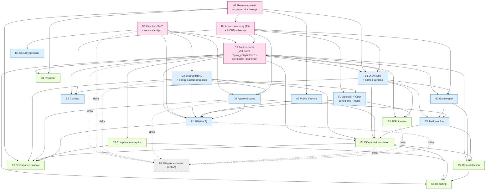

# MASTER-PLAN — Whole-Platform Implementation Plan (authoritative, parallelism-maximizing)

**Status:** ACTIVE · **Date:** 2026-05-30 · **Owner:** primary (cross-cut reconciliation agent)
**Reconciles:** `components/F3-mvp-sequencing/PLAN.md` (first draft) against all 23 component PLANs + the 6 `DOMAIN-SUMMARY.md` + the frozen C2 schema (`components/C2-audit-schema/SPEC.md §3.13`).

This is the single source of truth for *how the whole platform is built in parallel*: the inter-domain contracts that freeze first, the cross-component dependency DAG, the parallel build waves, the critical path, the MVP→Phase-2→Phase-3 cut lines, the N-team workstream allocation, and the risk-adjusted sequencing.

Where this plan and a component PLAN (or the F3 draft) disagree, the disagreement is called out inline with **[RECONCILED]** and the chosen resolution + reason.

---

## 0. Executive summary (the 10-line version)

- **4 foundation contracts freeze first** (not F3's 3): **C2** audit schema, **D1+D2** subject+scope, **A1** control_id+lineage, **B4** action taxonomy + CRD schema. F3 folded B4 into "config" and undercounted it as a *contract*; it is the 4th load-bearing contract because B1/B2/B3/C2/D3 all bake its `action` enum.
- **5 build waves**: W0 contract-freeze (C2, A1, D1, B4) → W1 scope+operator (D2, F2) → W2 engines+API+lifecycle (B1, A2, B2, B3, B5, F1, D4, D3-thin) → W3 simulation+analytics+PDP (E1, C3, E3, C5, C4, C1) → W4 console+integration (E2, AC-1..8).
- **Critical path (validated, lengthened):** `C2 → B1 → E1 differential simulation → E2 console`, but the *true* longest pole gates on **D2 → (F1 + E1 scoped replay)** running concurrently. The corrected critical chain is **C2 → B1 → E1 → E2** with **D2** as a co-equal long pole feeding E1/E2. See §4.
- **MVP is ~14 items, not 9** — F3's finding confirmed and itemized in §5: the 9 "headline" MVP components silently require 5 thin-slice enablers (D2, F1, F2, B4, D4) to function.
- **Two dependency cycles** had to be broken (B4↔B2 approval handshake; B5↔E1 replay-equivalence). Both broken by **contract-stub-first** (freeze the interface, co-develop the two sides). See §2.6 and §8.

---

## 1. Foundation contracts that freeze first (the inter-domain API)

These are the *typed seams between domains*. Every one is an interface that one domain **owns** and others **consume**; freezing the interface (not the implementation) unblocks parallel work everywhere downstream. The discipline: publish the contract + golden fixtures, let consumers code against stubs, integrate live later.

| # | Contract | Owner | Consumers | Freeze artifact | Status |
|---|---|---|---|---|---|
| **FC-1** | **C2 §13 audit event schema** — 36 fields (14 R / 18 C / 4 O), `c2.audit-event/1.0`, additive-only (N-C2-FWD) | **C2** | B1, B2, B3 (emit); E1, C3, C4, C5, C1 (consume); F1 (`/audit/events`); D1 (`jwt_claims` block); F4 (additive agent fields) | `C2 SPEC §3.13` field list + §5 state machine | **FROZEN** (M-FREEZE satisfied by the SPEC) |
| **FC-2** | **`correlation_id` anchor** = cluster-scoped K8s AdmissionReview UID; OPA MUST echo it (D-C2-03); federated dedup uses the scoped id | **C2** (defines), **B5** (threads it through admission→decision→audit) | every emitter + every consumer; D3 (CR name == correlation_id) | C2 §6 + B5 correlation_id contract | **FROZEN** |
| **FC-3** | **`replay_completeness` semantics** — `{complete \| best_effort \| insufficient}`; `partial` is a deprecated ingest-normalized alias (D-C2-01); synthetic events capped at `best_effort` (N-C2-NOPROMOTE); **policy-relative** (E1 recomputes per-bundle — a stored `complete` can be `insufficient` for a bundle reading a new field) | **C2** (defines + scores live); **E1** (recomputes at replay) | E1, C3, C4, C5 (honesty label propagates up); A2 (gate ack on low completeness, A-OQ-5) | C2 §5 + the cross-process scorer-determinism golden vectors (T-DET-2) | **FROZEN** (scorer-determinism is the live test, not a contract change) |
| **FC-4** | **D1 canonical authorization subject** — §15.4+§17A.4 superset `{subject_id, subject_type, tenants[], namespaces[], policy_domains[], roles[], groups[], …, claim_provenance, normalization_status, schema_version}`; consumers reference *canonical* fields only, never raw claim paths | **D1** | D2 (authorizes on it), D3 (approver identity), C2 (`jwt_claims` shape + provenance), F1 (every request), E2 (RBAC), F4 (agent subject chain delta) | D1 SPEC §15.4 mapping + `/normalize` output schema | **FREEZE in W0** |
| **FC-5** | **D2 scope predicate** — a *linkable library* (`ScopePredicate` indirection) doing row- AND field-level set-intersection filtering, usable even over **ordinary storage** (the §26.1-deferred-storage reconciliation); plus F2's minimum-storage contract (scope columns, append-only/versioned, content-hash) | **D2** (predicate lib), **F2** (storage minimum-contract) | F1 (every list/get), E1 (scoped replay materialization), E2 (graph edge/count filtering), D3, F2 | D2 SPEC §17A.5 metadata model + `authorize(subject,verb,object)` + predicate API | **FREEZE in W0/W1** |
| **FC-6** | **A1 control_id + lineage + GovernanceProjection** — `control_id` is the *universal join key* (A1 sole allocator, immutable global namespace, `aliases[]` backlog); `GovernanceProjection` cache (class, targets, required claims, ExceptionReq, current_policy_version); lineage edges (relational+temporal, no graph DB) | **A1** | B1/B2/B3/B4 (cache projection), A2 (lifecycle), C1 (Gemara eval), C2 (`control_id` field), E2 (lineage graph), C5 (coverage), D3 (ExceptionReq) | A1 SPEC §6 + GovernanceProjection schema | **FREEZE in W0** |
| **FC-7** | **B4 closed 13-action taxonomy + 6 CRD schemas** — the `action` enum {allow, deny, warn, mutate, … require_approval, exception, …} baked into the C2 `decision` field; CRD schemas for `PolicyApprovalRequest`, `PolicyException`, `PolicySimulationRun`, `PolicyActionLibrary`, `PolicyEvidenceSchema`, `PolicyRemediationAction` | **B4** (schema owner) + **F2** (controller/operator owner) — **[RECONCILED]** split ownership (below) | B1/B2/B3 (emit `action`), C2 (bakes enum into schema), E1 (`PolicySimulationRun`), D3 (`PolicyApprovalRequest`/`PolicyException`), F2 (operator hosts CRDs) | B4 SPEC §17C.3 action table + §17C.6 CRD schemas | **FREEZE in W0** |

### 1.1 Why **4** foundation contracts, not F3's 3 — [RECONCILED]
F3 §3.1 names three contracts (C2 schema; D1+D2; A1). **This plan promotes B4's action taxonomy to a 4th first-class foundation contract.** Rationale, drawn straight from the component PLANs:
- B4 PLAN: *"Blocks B1/B2/B3/C2/E1: the action enum (W1) — freeze it first."*
- C2 DOMAIN-SUMMARY OQ5 is flagged **decided-but-contested**: the *action model* (linear-precedence vs disposition+obligations, B4-AR-7) **"must resolve before C2 bakes it in."** That makes B4's action model a hard input to FC-1 itself.
- Treating B4 as mere "config" (F3's framing) hides a freeze that, if it slips, churns the C2 schema *and* every engine. It is exactly as load-bearing as the other three. **Decision: 4 contracts freeze in W0.**

### 1.2 The CRD-ownership collision — [RECONCILED]
B4 PLAN and F2 PLAN both claim the §17C.6 CRD surface (F3 risk #4; F-summary decision 5). **Decision (adopt F-summary's recommendation): B4 owns the CRD *schemas* (the API/contract); F2 owns the *controllers + operator + install* (the runtime).** One schema source of truth, one operator runtime. This must be ratified before W0 ends or B2/D3/E1 fork the CRD definitions.

---

## 2. The cross-component dependency DAG (all 23)

Edges are **real blocking edges** derived from the component PLANs' "what blocks what" sections and the domain summaries. Solid = hard build/contract dependency; dashed = Phase-3 *delta* dependency (F4 rides existing contracts, adds no primitive).

### 2.1 Notable edges and where they come from
- **C2 → {B1,B2,B3,E1,C3,C4,C5,C1,E3,F1}** — every emitter and every consumer (C2 PLAN; C2 DOMAIN-SUMMARY §7).
- **A1 → B1/B4** — B1 PLAN "Blocked by A1: needs control catalog"; B4 PLAN "[A1 control catalog] → W2 rubric".
- **D1 → C2** — D1 defines the `jwt_claims` block + provenance for the §13.3 schema (D-summary §2; D2 internal-deps mermaid). *Note this is the one edge where a Domain-D contract feeds C2; it is a field-shape contract, not a build blocker — C2 can freeze its field list with a D1 stub and refine `jwt_claims_completeness` semantics in W2.*
- **B4 → C2** — the action enum is baked into C2's `decision` field (B4 PLAN; C2 OQ5). This makes B4↔C2 a **freeze-ordering constraint**, handled by freezing both together in W0.
- **D2 → {F1, E1, E2}** — F1 "WS-B blocks any real data return"; E1 "WS-B Evidence Layer blocks on D2"; E2 "WS-P scope gates the rest". This is the **scope-predicate fan-out**, the platform's #1 risk.
- **B5 → {C4, E1}** and **B2 → C4** — B5 PLAN "Blocks C4 (expected-decision-set export); E1 (replay equivalence)"; B2 PLAN "Blocks C4 (absence semantics for §19)".
- **E1 → {C4, C5, E2}** — C4 PLAN "blocks on E1 replay"; C5 R3 needs E1; E2 Audit-Correlation-View *is* E1's surface.
- **F4 dashed** — F4 PLAN: deltas on C2/D1/D2/D3/E1/E3/F1; "Base MVP (F3) blocks F4 ship."

### 2.2 The two cycles that had to be broken
1. **B4 ↔ B2 (approval handshake).** B4 PLAN: *"Blocked by B2: the admission-side of the approval handshake."* B2 PLAN: *"Blocked by B4: approval/exception CRDs + controllers."* This is a genuine 2-cycle. **Broken by: freeze the deny-with-approval *contract* (deny → `PolicyApprovalRequest` CRD → bounded Gatekeeper external-data re-eval, `failurePolicy: Fail`) in W0, then co-develop B4-W4a and B2-W4 as one vertical slice.** The DAG above shows only `B4 → B2` (schema dependency); the reverse runtime co-dependency is resolved by joint development, not by ordering. This is the domain's keystone integration (B-summary hardest-decision #2).
2. **B5 ↔ E1 (replay equivalence).** B5 owes E1 "replay equivalence"; E1's eval harness (WS-A) consumes B-engine eval/dry-run. **Broken by: E1's `ReplayEventV1` adapter + synthetic fixtures (E1 MVP-0)** decouples E1 from live engines; B5 integrates its expected-decision-set export later. DAG shows `B5 → E1` (the live-data direction); E1 starts on stubs.

### 2.3 Edges this plan *removed* from F3's draft — [RECONCILED]
- F3 draws **C2 → B1** as "the contract everyone emits" but also implies B1 gates on a *full* C2. **Corrected:** B1 only needs the **frozen field list** (a vendored constant), not a running C2. C2's own internals (W4–W9) are off B1's critical path. (C2 PLAN explicitly: downstream is unblocked at M-FREEZE for design, M4 for live data.)
- F3 puts **A1 on the critical path** via "governance spine." **Corrected (per A-summary §5):** A1 is buildable first and *largely independently* (its only upstream, the §13.3 field list, is vendored as a constant). A1 is a **foundation contract, not a critical-path bottleneck** — it ships early and waits on nobody. Its WS-F projection is the gating deliverable *for B2/B3/B4/D3*, so prioritize that sub-stream, but A1 itself is not the long pole.

---

## 3. Parallel build waves (maximize width)

Each wave is everything buildable **concurrently** once the prior wave's contracts are frozen. "Unblocked by" states the exact gate.

### Wave 0 — Contract freeze (4 streams, fully parallel) · *gate: 4 contracts published + golden fixtures*
| Stream | Component | Produces | Unblocked by |
|---|---|---|---|
| W0-a | **C2** | §13 field list, state machine, correlation anchor, replay_completeness semantics (FC-1/2/3) | nothing (vendors a D1 `jwt_claims` stub + B4 action-enum stub; reconciles in W2) |
| W0-b | **A1** | control_id authority, GovernanceProjection schema, lineage model (FC-6) | nothing (vendors §13.3 field-list constant) |
| W0-c | **D1** | canonical subject + `/normalize` schema (FC-4) | nothing |
| W0-d | **B4** | closed 13-action taxonomy + 6 CRD schemas (FC-7); resolve action-model OQ (linear vs disposition+obligations) **before C2 bakes it** | A1 control-catalog stub |

> **Synchronization point:** a hard **1-week contract freeze** ends W0. Deliverable = published schemas + golden fixtures (golden §13 events, golden JWT→subject mappings, golden lineage records, golden CRD instances) so no contract can silently drift (F3 test-strategy §7). **B4↔C2 action-model and B4 CRD-ownership must be resolved *inside* this week.**

### Wave 1 — Scope predicate + operator substrate (2 streams) · *gate: D2 predicate library linkable; F2 CRDs installable*
| Stream | Component | Produces | Unblocked by |
|---|---|---|---|
| W1-a | **D2** | `ScopePredicate` library (row+field set-intersection over ordinary storage), role registry, authz decision fn, storage interceptor keystone (W6) | D1 subject contract (FC-4) + A1 control_id |
| W1-b | **F2** | operator skeleton, CRD controllers, minimum-storage contract, single-cluster install | B4 CRD schemas (FC-7) |

> **Why D2 is its own wave and pulled forward:** D2's scope predicate fans out to F1, E1, E2, D3 — it is the **#1 schedule + correctness risk** (F1 DEFECT-1, F2 DEFECT-1, F3 risk #1). It cannot wait for W2. **[RECONCILED]:** F3 places D2 in "Wave 1 foundation" alongside C2/A1; this plan agrees it's foundational but separates it into **W1** because it *consumes* D1 (FC-4) and therefore cannot literally start at T0 with the other three. It starts the moment D1's subject contract is stubbed (day 1-2), so in practice it overlaps W0 heavily — but its *completion* gates W2's F1, so it earns its own wave for scheduling honesty.

### Wave 2 — Engines + lifecycle + API + security (8 streams, parallel) · *gate: enforce + emit §13; API serves scoped data; AC enforcement path green*
| Stream | Component | Produces | Unblocked by |
|---|---|---|---|
| W2-a | **B1** | OPA/Rego engine, signed bundles, decision logs (emits §13) | FC-1 (C2 schema), FC-7 (action enum), A1 control catalog (stub→live) |
| W2-b | **B2** + **B5** | Gatekeeper admission (17-field) + realtime flow + deny-with-approval slice | B1 decision contract, B4 CRDs, D1 subject, FC-2 correlation_id |
| W2-c | **B3** | Conftest CI gate, normalized evidence | B1 entrypoint + input-normalization contract, B4 build-time action subset |
| W2-d | **A2** | policy lifecycle FSM, promotion gates (against E1 *result-contract stub*) | A1 ControlActivated event contract |
| W2-e | **F1** | the 8 endpoints over D2 scope predicate + envelope | D2 predicate (FC-5), D1 token validation (FC-4), F2 |
| W2-f | **D3-thin** | `suspend_pending_approval` + 1 webhook + CRD state machine (never-blocks) | B4 CRDs, D2 approval permissions, FC-2 |
| W2-g | **D4** | security baseline (TLS/OIDC/signing/audit), SEC-1..23 register | cross-cutting; lands incrementally across all W2 streams |
| W2-h | **E1 MVP-0/1** | `ReplayEventV1` adapter + eval harness on **stubs** (start the long pole early!) | FC-1 field list only (synthetic fixtures) — see §7 |

### Wave 3 — Simulation + analytics + PDP + reporting (6 streams, parallel) · *gate: AC-5 (differential sim) + AC-7 (bypass/drift detection) pass*
| Stream | Component | Produces | Unblocked by |
|---|---|---|---|
| W3-a | **E1 MVP-2..5** | differential engine (the differentiator), tagging, mode adapters M1-M9, `PolicySimulationRun` controller | B1 live engine, D2 scoped replay (FC-5), A2 result-contract, FC-3 |
| W3-b | **C3** | 2 detections (bypass + JWT drift, §14.2) | FC-1 + C2 M4 live query API |
| W3-c | **E3** | template (WS-T, gates all) → K8s PDP lib + 1-2 more (9 are embarrassingly parallel) | B1 engines, FC-1, F2 plugin SPI |
| W3-d | **C5-thin** | 1 report category (R1, C2-only) + signed package | FC-1 + C2 integrity primitive (§7.6) |
| W3-e | **C4** | retrospective sweep, violation population | FC-1 + C3 detector lib + E1 replay (most-blocked; design on stubs) |
| W3-f | **C1** | Privateer Gemara eval *(can begin design; ships Phase-2)* | FC-1 + A1 Gemara model |

### Wave 4 — Console + end-to-end integration (2 streams) · *gate: AC-1..8 pass = MVP done*
| Stream | Component | Produces | Unblocked by |
|---|---|---|---|
| W4-a | **E2** | Headlamp console: plugin shell (auth+RBAC) → graph backend → Graph View (differentiator) + replay/sim/analytics/authoring views | D1/D2 scope (FC-4/5), F1 API, A1 lineage, E1 sim, C3 violations |
| W4-b | **integration** | AC-1..8 wiring + 3 core (≤2 optional) integrations; scope-isolation tests across F1+D2+E1 | all of W2/W3 |

---

## 4. Critical path (the longest pole)

F3's claim: **`C2 schema → B1 engine → E1 differential simulation → E2 console`.** **[VALIDATED with one correction.]**

The chain is correct as the *novelty/integration* longest pole. But it understates a **co-equal pole through D2** that, if not run concurrently, *becomes* the longest path because E1's scoped replay and E2's entire shell gate on D2's scope predicate (D2 → E1, D2 → E2). The corrected picture has **two interleaved poles converging at E2**:

**Primary critical path (ordered):**
1. **C2** schema freeze (FC-1/2/3) — *gates everything downstream's design*
2. **B1** OPA/Rego engine emitting §13 + stable replay interface (W1→W3→W4→W6 internal)
3. **E1** differential simulation engine (MVP-2: WS-B evidence → WS-A harness → WS-C differential → WS-F report) — *the longest single high-novelty build; the headline demo AC-5*
4. **E2** governance console (WS-P shell → WS-GB graph backend → WS-G Graph View) — *integrates F1/A1/E1/C3*

**Co-equal pole (must run concurrently, else it dominates):**
- **D1** subject → **D2** scope predicate (W4→W6 interceptor keystone) → feeds **E1** scoped replay *and* **E2** shell. If D2 slips, E1's authoritative scoped replay and E2's trustable views both slip — so D2 is on the critical path *in effect* even though it's not on the C2→B1→E1→E2 spine.

**Net critical-path statement:** `C2 → B1 → E1 → E2`, with `D1 → D2` as a parallel pole feeding E1 and E2 that **must be resourced from T0** to stay off the critical path (see §7). E1 is the single longest build; D2 is the single highest-risk build. The headline MVP demo (AC-5 differential simulation, HL-17) sits at the **E1→E2** junction and is the gating acceptance for "MVP done."

---

## 5. MVP cut line → Phase 2 → Phase 3 (GA)

### 5.1 The "9 is really ~14" reconciliation — [RECONCILED, F3 finding confirmed]
F3's headline MVP list reads as ~9 marquee capabilities (A1, A2, B1, the enforcement engines, C2, E1, E2, C3, C5). The component PLANs reveal that these **cannot function without 5 thin-slice enablers** that F3 itself tags MVP-thin but that are easy to under-resource:

| Hidden enabler | Why it's actually MVP-required | Evidence |
|---|---|---|
| **D2** scope predicate (thin) | F1 *cannot return real data without it* (would leak); E1 scoped replay needs it; E2 shell needs it | F1 DEFECT-1, E1 WS-B, E2 WS-P |
| **F1** API (the 8) | E2 console has no backend without it; it's the AC surface | E2 critical path; AC-1..8 |
| **F2** operator + core CRDs (thin) | nothing installs; CRDs (approval/exception/sim) have no controllers | F2 critical path; D3/E1 need CRD runtime |
| **B4** taxonomy + CRD schemas | the `action` enum + CRDs every engine and C2 bake | B4 "freeze first"; C2 OQ5 |
| **D4** security baseline | the POC-MUST floor (server-side authz, OIDC, signing, audit) — not optional for a *governance* product | D-summary decision 5 |

**So the real MVP is the ~14 = 9 marquee + 5 enablers.** This plan makes all 14 explicit in Waves 0-4. The cut-line honesty: calling D2/F1/F2/B4/D4 "config/thin" does not remove them from the critical schedule — they are *thin in feature scope, not in dependency weight.*

### 5.2 The three phases

| Phase | Theme | Components (status) | Exit gate |
|---|---|---|---|
| **MVP** (Waves 0-4) | Govern → enforce → emit → simulate → see, scoped + secure | A1, A2, B1, B2, B3, B4, B5, C2, **C3(2 detections)**, **C5(1 report)**, D1, **D2(thin)**, **D3(thin)**, **D4(baseline)**, E1, E2, **E3(K8s+1-2)**, F1, **F2(thin)**, F3(meta) | **AC-1..8 pass**; differential sim (AC-5/HL-17) + bypass/drift detection (AC-7) demonstrable; scope-isolation (DT-55) green |
| **Phase 2** (depth, parallel) | Wedge features + evidence depth | **C1** Privateer, **C4** advanced retro, **D3** full approval mesh, **C5** rich/multi-framework reports, **E3** full §17D catalog, lineage **graph DB**, export adapters (SIEM/GRC), multi-IdP, cross-cloud | wedge differentiation features shippable |
| **Phase 3 (GA)** | AI/agent governance as deltas | **F4** on C2/D1/D2/D3/E1/E3/F1 (no base refactor): agent subject chain, evaluator_results audit fields, two-tier async behavioral evaluators, agent PDP catalog, trust gradient | agent governance proven on the validated base → **GA** |

**Phase rationale:**
- **MVP = the cross-product-consistency thesis end-to-end on one product (K8s).** It proves: one Rego decides everywhere, every decision is replay-capable and scoped, you can simulate a policy change before promoting it, and you can detect a bypass. That is the defensible core (no OSS product offers differential sim + lineage graph + uniform PDP).
- **Phase 2 = depth on the proven spine.** C4 is deferred because it is *the most-blocked component* (needs C2 + C3 + E1) — building it last is correct, not a compromise. C1/multi-IdP/graph-DB/export-adapters are breadth that doesn't change the architecture.
- **Phase 3 = F4 deltas, base-first.** F4 PLAN's thesis and F-summary decision 3: F4 is *structurally blocked by nothing* but *gated by judgment* — ship base-first so agents validate against a proven platform. F4 design MAY begin in parallel with Phase 2; it *ships* after MVP validates the architecture. Product may separately market an agent-first wedge (ALT-1) — a positioning axis, not an engineering reordering.

---

## 6. Workstream allocation (N parallel teams/agents)

Goal: minimize idle time and cross-team blocking. The natural team count is **4** (matches the 4 foundation contracts and keeps a team on each long pole). Below is the assignment for **N=4**, with notes for N=2 and N=6.

### N = 4 teams (recommended)
| Team | Owns (by domain affinity) | W0 | W1 | W2 | W3 | W4 |
|---|---|---|---|---|---|---|
| **T1 · Evidence/Sim** (the long pole) | C2, E1, C4, C5 | **C2** freeze | help D2 (scope→replay contract) | **E1 MVP-0/1** (stubs) | **E1 MVP-2..5**, C4, C5 | E1↔E2 integration |
| **T2 · Engines** | B1, B2, B3, B4, B5, E3 | **B4** freeze | — | **B1**, B2+B5, B3 | **E3** (template→K8s) | engine↔console wiring |
| **T3 · Identity/Platform** | D1, D2, D3, D4, F1, F2 | **D1** freeze | **D2** (keystone), **F2** | **F1**, D3-thin, D4 | D3/D4 hardening | integration, scope-isolation tests |
| **T4 · Governance/Console** | A1, A2, C3, E2 | **A1** freeze | A1 WS-F projection (unblocks B/D3) | **A2**, C3 design | **C3** (2 detections) | **E2** console (lead W4) |

**Why this split minimizes idle time:**
- Each team owns exactly one **W0 contract** → no team waits on another to start.
- **T1 starts the longest pole (E1) earliest** on stubs (W2-h) — no idle wait for live C2/B1.
- **T3 owns the highest-risk pole (D2)** end to end and also the things that consume it (F1, F2) → the scope predicate's producer and primary consumers are one team → no cross-team scope-contract churn.
- **T4 owns A1 (waits on nobody) then C3/E2** → it's never blocked early and lands the console last.
- Cross-team handoffs are **contract handoffs only** (the 7 FCs + golden fixtures), never live-code handoffs.

### N = 2 teams (minimum viable)
- **Team Alpha** = T1+T2 (Evidence/Sim + Engines): C2, B1-B5, B4, E1, E3, C3, C4, C5.
- **Team Beta** = T3+T4 (Identity/Platform + Governance/Console): D1-D4, F1, F2, A1, A2, E2.
- Risk: D2 (Beta) and E1 (Alpha) are the two poles on different teams — needs tight scope-predicate contract discipline (FC-5 golden fixtures are mandatory).

### N = 6 teams (max useful width)
Split T1→(C2/C5) + (E1/C4); split T2→(B1/B4/B5) + (B2/B3/E3). Beyond 6, **E3's 9 PDP libraries are embarrassingly parallel** (E3 PLAN) — surge extra agents there in W3 with zero coordination cost once the template (WS-T) is frozen. **Do not** add teams to E1's differential engine (WS-C is a tight, serial, single-author core) or D2's interceptor (W6 keystone) — they don't parallelize internally.

---

## 7. Risk-adjusted sequencing notes

Start the longest poles early even when not strictly unblocked, because their slip dominates the schedule.

1. **E1 from T0 on stubs (E1 MVP-0).** E1 is the single longest high-novelty build (differential engine WS-C is serial) and gates the headline demo. **Action:** build the `ReplayEventV1` adapter + synthetic fixtures the moment FC-1's field list publishes (W0), and run WS-A/WS-C against stubs through W2. Do **not** wait for live C2/B1. F3 risk #3 ("E1 underestimated") — resource it first.
2. **D2 pulled forward into W1, overlapping W0.** D2's scope predicate is the #1 schedule + correctness risk and fans out to F1/E1/E2/D3. **Action:** start D2's role/permission front (W1+W2+W3) against a D1 *stub* during W0, converge on the interceptor (W6) the moment FC-4 freezes. Build the predicate as a *library over ordinary storage* so the §26.1 deferred-storage contradiction never blocks it. (F3 risk #1.)
3. **C2 schema freeze is the gating date for the whole platform.** Any churn after engines emit it = mass rework. **Action:** freeze the *contract* in W0 (the SPEC already does), additive-only (N-C2-FWD), and resolve the B4 action-model question (B4-AR-7) *inside* the freeze week so C2 doesn't bake a wrong model. (F3 risk #2; C2 OQ5.)
4. **B4 action taxonomy + CRD ownership resolved inside W0.** Unowned CRDs → duplicate definitions across B4/F2/D3 (F3 risk #4). **Action:** ratify "B4 owns schema, F2 owns controllers" before W0 ends.
5. **The deny-with-approval vertical slice (B2+B4+B5+D3) built as ONE slice in W2.** It's the keystone integration and the riskiest (durability of deny→CRD hand-off, single-use idempotency, never-held webhook). **Action:** don't let the four owners build their legs independently; co-develop the slice. (B-summary hardest-decision #2.)
6. **The cross-engine conformance suite (B1-R30) is the highest-value test** — proving REST=Wasm=Gatekeeper=Conftest semantics. Start it as soon as B1's corpus exists; it gates the "shared cross-product semantics" claim.
7. **F4 design MAY start in Phase 2, but ships base-first.** Structurally unblocked, judgment-gated. Don't let F4 scope creep into MVP (F3 risk #5).

---

## 8. Dependency cycles broken (summary)

| Cycle | Components | How broken |
|---|---|---|
| **Cycle 1 — approval handshake** | B4 (needs B2 admission side) ↔ B2 (needs B4 CRDs) | Freeze the deny→`PolicyApprovalRequest`→external-data-re-eval **contract** in W0; co-develop B4-W4a + B2-W4 as one vertical slice. DAG keeps only the `B4→B2` schema edge. |
| **Cycle 2 — replay equivalence** | B5 (owes E1 replay equivalence) ↔ E1 (consumes engine eval) | E1 `ReplayEventV1` adapter + synthetic fixtures (MVP-0) decouple E1 from live engines; B5's expected-decision-set export integrates later. DAG keeps only the `B5→E1` live-data edge. |

Both follow the same discipline as the foundation contracts: **freeze the interface, stub it, integrate the implementation later.** No structural cycle remains in the build DAG.

---

## 9. Cross-reference to F3 (what changed and why)

| F3 draft said | This plan says | Reason |
|---|---|---|
| 3 foundation contracts (C2, D1+D2, A1) | **4** (adds B4 action taxonomy + CRD schema) | B4 enum is baked into C2 + every engine; C2-OQ5 says resolve before C2 bakes it (B4 PLAN, C2 DOMAIN-SUMMARY) |
| D2 in Wave-1 foundation alongside C2/A1 | D2 in **W1** (its own wave, overlapping W0) | D2 *consumes* D1 (FC-4) so it can't literally start at T0; its completion gates W2 F1 |
| A1 "governance spine" on the build path | A1 = foundation contract, **not a critical-path bottleneck** | A-summary §5: A1 builds first and independently; only its WS-F projection gates downstream |
| Critical path `C2→B1→E1→E2` | **Validated**, + adds **D1→D2 as co-equal pole** feeding E1/E2 | D2→E1 and D2→E2 edges make D2 dominate if not run concurrently |
| MVP "9 items" framing | MVP is **~14** (9 marquee + 5 enablers: D2/F1/F2/B4/D4) | F3's own finding, itemized; thin-in-scope ≠ thin-in-dependency-weight |
| CRD ownership "nominate an owner" | **Decided**: B4 owns schemas, F2 owns controllers/operator | F-summary decision 5; resolve in W0 |

---

*End MASTER-PLAN. Companion docs: `MASTER-PLAN-ALT.md` (alternative overall sequencing), `CROSSCUT-ADVERSARIAL.md`, `DATA-MODEL.md`, `TRACEABILITY.md`.*
