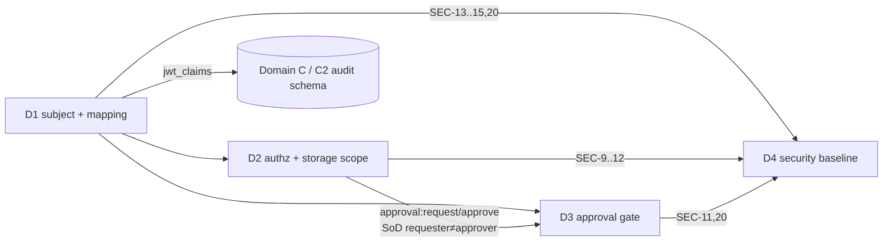

# Domain D — Identity, Authz & Security — SUMMARY

The domain that decides **who you are, what you may touch, when a decision must wait for a
human, and the security floor everything stands on.** Four components form a pipeline:

```
 IdP token ──D1──► canonical subject ──D2──► scoped authz decision
                                          └─D3──► (if non-terminal) approval gate
 D4 ── security baseline (SEC-1..23) wraps all three ──────────────────────────►
```

---

## 1. Shared data model

### 1.1 The canonical normalized authorization subject (D1 → everyone)
The single most important shared object. Superset of §15.4 + §17A.4:
`{subject_id, subject_type, username, email, issuer, tenants[], namespaces[], policy_domains[],
roles[], groups[], environment, risk_level, …, claim_provenance, normalization_status,
schema_version}`. **Every downstream component references the *canonical* fields only** — never a
raw upstream claim path. This indirection (the §15.4 mapping layer) is what makes multi-IdP
onboarding (HL-16) and claim evolution (DT-35/36/37) a config change rather than a fleet edit.

### 1.2 Object authorization metadata (D2, §17A.5)
Every stored object carries `{object_type, cluster, namespaces[], policy_domains[], control_ids[],
tenant, created_by, visibility}`. The storage interceptor filters every query against the
subject's scope using **set intersection**, not string containment.

### 1.3 Approval state (D3, §17C.6 CRDs)
`PolicyApprovalRequest` / `PolicyException` are the **authoritative** approval state
(pending→approved/denied/expired). The CR **name doubles as `correlation_id`**, threading deny →
CR → webhook → callback → admit into one queryable key. The webhook is fire-and-forget; the CRD
is the source of truth.

### 1.4 The security register (D4)
SEC-1..23 maps §23's seven areas to numbered, testable controls; D1/D2/D3 controls each map to a
SEC-n; the cross-cutting TRACEABILITY.md consumes this.

---

## 2. Internal dependencies (within Domain D)

- **D1 → D2:** D2 cannot authorize without the canonical subject; each `role:<x>` D1 expands
  (DT-38) must be registered in D2's role registry (the D1↔D2 contract).
- **D2 → D3:** approval `request`/`approve` permissions and the requester≠approver SoD come from
  D2's matrix; D3 *runs* the gate D2 *authorizes*.
- **D1 → Domain C (C2):** D1 defines the `jwt_claims` block shape + provenance for the §13.3
  audit schema — the explicit cross-domain dependency called out in the brief.
- **All → D4:** every component maps its controls to SEC-n.

---

## 3. The 3–5 hardest decisions

1. **Storage-layer enforcement mechanism (D2 OQ-1 + ALT).** §17A.1 forbids GUI-only authz. The
   primary picks an **app-layer mandatory query-rewrite interceptor** (one auditable choke
   point); the ALT shows RLS / OPA-partial-eval / SpiceDB ReBAC. **Decision: app-interceptor for
   the POC, with Postgres RLS as defense-in-depth on the relational subset, evolving toward
   OPA-partial-eval post-POC** — kept behind a `ScopePredicate` indirection so it's an evolution,
   not a rewrite. Rationale: auditability of the choke point matters most for a scope-escape-
   sensitive control; the adversarial review (D2 A1) shows a lint-only choke point is too weak,
   so RLS-under-interceptor is promoted toward mandatory.

2. **Kubernetes admission cannot block (D3, §17B.4).** Admission webhooks have short deadlines
   and `failurePolicy` either denies-all or admits-all on timeout. **Decision: deny-with-
   approval-required + create/poll a `PolicyApprovalRequest` CRD + re-evaluate on retry via
   Gatekeeper external data**, with `failurePolicy: Fail` mandatory. Approval is long-running
   *platform state*, never a held connection.

3. **Token staleness vs hot-path purity (D1 OQ-5/D2 OQ-6/D3 A12).** D1 forbids hot-path network
   calls (determinism, latency); but revoked roles/approvals in a still-valid token are a real
   bypass. **Decision: server-side grant store is authoritative; cheap reads trust the token,
   high-value/privileged ops re-check the grant store; privileged-role tokens get bounded
   lifetimes.** This carves a deliberate revocation exception to the no-network rule.

4. **Approval-resolution trust (D3 A1/A5/A8).** The gate is only as strong as *what* it trusts:
   **Decision: approval binds to the resource's spec digest (not just its name) so "approve-then-
   swap" fails; callbacks must carry approver-bound proof (not just a shared workflow HMAC); and
   the PDP compares `now` to `expires_at` at every evaluation rather than trusting a reconciler-
   maintained status field.**

5. **POC security floor vs GA hardening (D4).** §23 is terse and uses "should." **Decision: a
   hard floor of correctness/trust controls is POC-MUST (server-side authz, OIDC verification,
   SoD, auditability, transport for trust-bearing channels); signing, audit-chaining, mTLS-
   everywhere, and platform supply-chain dogfooding are tagged SHOULD→MUST@GA with named gates**
   — explicitly to stop "should" from becoming "never."

---

## 4. Consolidated open-questions list (decided defaults)
| From | Question | Default |
|---|---|---|
| D1 OQ-1 | Group→role expansion at issuance vs normalization | Normalization-time (issuance as size opt) |
| D1 OQ-3 | Multi-IdP conflict resolution | Mapping layer, issuer-scoped sources, `prefer_first_non_empty` |
| D1 OQ-5/D2 OQ-6 | Token-trust vs grant-store re-check | Grant store authoritative for privileged ops |
| D2 OQ-1 | Storage enforcement mechanism | App interceptor + RLS DiD → OPA partial-eval later |
| D2 OQ-2 | Out-of-scope by ID | 404 (no existence signal) |
| D2 OQ-3 | Counts/cursors | Over filtered set |
| D3 OQ-2 | Correlation id | CR name == correlation_id |
| D3 OQ-3 | Approval binding | Resource ref + spec digest |
| D3 OQ-4 | `require_async_check` timeout | Deny (fail closed) |
| D4 OQ-1 | Bundle signing tech | Unspecified; require verification property + versioning now |
| D4 OQ-4 | PII at rest in audit | Hash-at-rest for `sub`/`email`, grant-gated reveal |

---

## 5. The one-paragraph thesis
Domain D is the platform's trust spine. **D1** makes identity *normalized and decoupled* so
policy never touches raw claims. **D2** makes authorization *real* by enforcing it where the data
lives, not where the GUI is — the §17A.1 invariant is the domain's signature requirement and its
DT-55 pen-test the domain's signature test. **D3** makes "wait for a human" *durable* without
ever holding an admission webhook open. **D4** turns §23's terse list into a numbered, tested,
trajectory-managed baseline — and insists the governance platform govern *itself*. The recurring
discipline across all four: **fail closed, log power, trust state over tokens, and prove the
control by trying to break it.**
